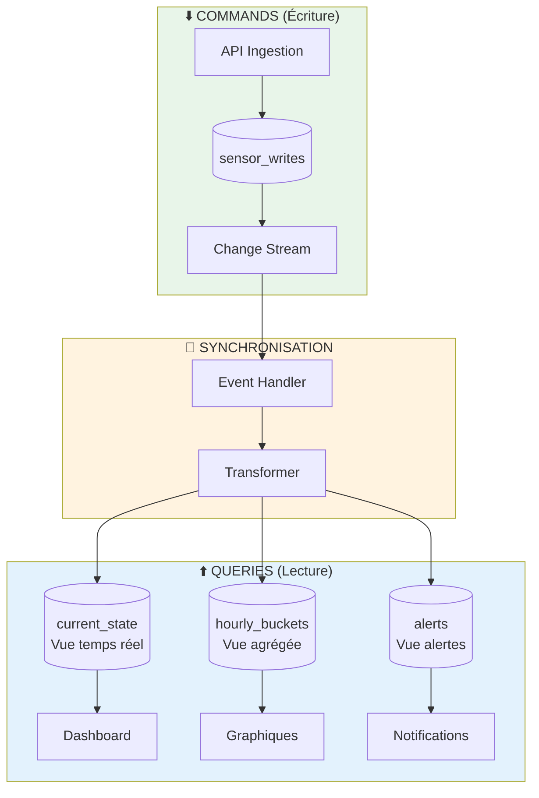
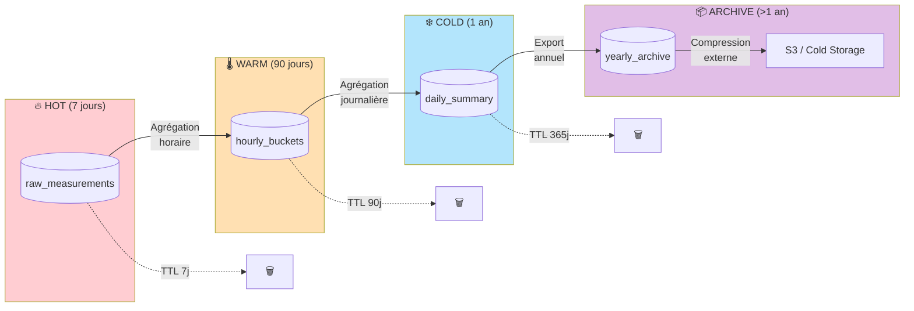
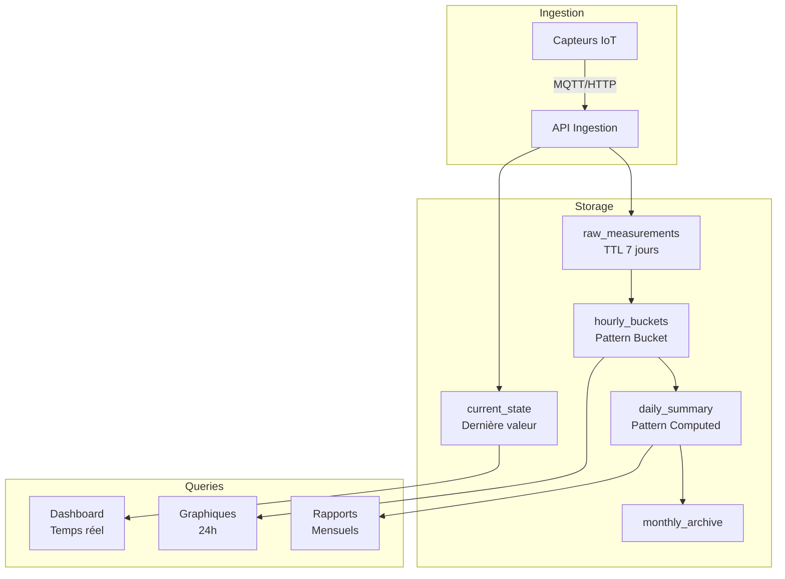

#  R5.Real.10 - Nouveaux paradigmes de base de données

### IUT d’Aix-Marseille – Département Informatique Aix-en-Provence

* **Ressource:** [R5.Real.10](https://cache.media.enseignementsup-recherche.gouv.fr/file/SPE4-MESRI-17-6-2021/35/5/Annexe_17_INFO_BUT_annee_1_1411355.pdf)
* **Responsables:**
  * [Sébastien Nedjar](mailto:sebastien.nedjar@univ-amu.fr)
* **Besoin d'aide ?**
  * Consulter et/ou créer des [issues](https://github.com/IUTInfoAix-R510/Cours/issues).
  * [Email](mailto:sebastien.nedjar@univ-amu.fr) pour une question d'ordre privée, ou pour convenir d'un rendez-vous physique.

# Travaux pratiques R5.Real.10 - Modélisation avancée et patterns de conception MongoDB (4h)

## 🎯 Objectifs de la séance

### Objectifs pédagogiques
À l'issue de cette séance, vous serez capable de :
- **Choisir** entre embedding et référencement selon le cas d'usage
- **Appliquer** les patterns de modélisation MongoDB (Subset, Computed, Bucket, etc.)
- **Optimiser** les modèles pour les performances et la scalabilité
- **Concevoir** des schémas pour des applications IoT temps réel
- **Implémenter** des patterns avancés (versioning, archiving, CQRS)

### Lien avec le projet fil rouge
Cette séance est **cruciale** pour votre projet :
- Pattern **Bucket** pour les séries temporelles de capteurs
- Pattern **Computed** pour les statistiques pré-calculées
- Pattern **Outlier** pour les pics de données
- Architecture **CQRS** pour séparer lecture/écriture

### Prérequis
- TP1 et TP2 complétés
- Compréhension des pipelines d'agrégation
- MongoDB Atlas configuré et accessible

---

## 📚 Phase 1 : Les fondamentaux de la modélisation MongoDB (45 min)

### Embedding vs Référencement

En MongoDB, vous avez deux grandes stratégies pour modéliser les relations entre données :

#### 🔗 Embedding (Imbrication)

L'**embedding** consiste à stocker les données liées **dans le même document**.

```javascript
// ✅ EMBEDDING : L'adresse est DANS le document utilisateur
{
    _id: "user123",
    name: "Alice Martin",
    email: "alice@example.com",
    address: {                    // ← Données imbriquées
        street: "123 Rue de la Paix",
        city: "Aix-en-Provence",
        zipcode: "13100"
    }
}
```

**Avantages** : Une seule requête pour tout récupérer, données atomiques, pas de jointure.

**Inconvénients** : Duplication de données, limite 16MB par document, mise à jour plus complexe.

#### 🔀 Référencement

Le **référencement** consiste à stocker les données dans des **documents séparés** reliés par un identifiant.

```javascript
// ✅ RÉFÉRENCEMENT : L'adresse est dans une collection séparée

// Collection users
{
    _id: "user123",
    name: "Alice Martin",
    email: "alice@example.com",
    address_id: "addr456"         // ← Référence vers l'autre document
}

// Collection addresses
{
    _id: "addr456",
    street: "123 Rue de la Paix",
    city: "Aix-en-Provence",
    zipcode: "13100"
}
```

**Avantages** : Pas de duplication, données partageables, pas de limite de taille.

**Inconvénients** : Nécessite plusieurs requêtes ou `$lookup`, pas de transaction atomique native.

#### Le spectre de la modélisation

En réalité, ce n'est pas un choix binaire. Il existe un **spectre** d'options :


| Approche | Description | Exemple |
|----------|-------------|---------|
| **Embedding complet** | Toutes les données liées dans le document | User + toutes ses commandes |
| **Embedding partiel** | Seulement un sous-ensemble utile | User + 5 dernières commandes |
| **Hybride** | Mix des deux selon le contexte | User + résumé commandes + ref vers détails |
| **Références avec cache** | Référence + copie des champs fréquents | Commande + {user_id, user_name} |
| **Références pures** | Uniquement les IDs, comme en SQL | Commande + user_id seul |

#### Tableau récapitulatif

| Critère | Embedding | Référencement |
|---------|-----------|---------------|
| **Lecture** | 1 requête | Plusieurs requêtes ou $lookup |
| **Écriture** | Mise à jour document entier | Mise à jour ciblée |
| **Duplication** | Possible | Évitée |
| **Taille max** | 16 MB par document | Illimitée |
| **Atomicité** | Garantie (même document) | Requiert transaction |
| **Cas d'usage** | Données lues ensemble | Données indépendantes |

### Les facteurs de décision

#### La matrice de décision

Pour chaque relation, posez-vous ces questions :

| Question | → Embedding | → Référencement |
|----------|-------------|-----------------|
| **Cardinalité ?** | 1:1 ou 1:few (< 20) | 1:many ou N:N |
| **Lus ensemble ?** | Oui, presque toujours | Non, souvent séparément |
| **Taille bornée ?** | Oui, croissance limitée | Non, peut croître indéfiniment |
| **Fréquence de mise à jour ?** | Rarement modifié | Souvent modifié |
| **Besoin d'accès indépendant ?** | Non | Oui, requêtes séparées |

**Règle simple :** Si vous avez plus de trois réponses dans la colonne "Référencement", privilégiez les références.

### Exercices

Ces exercices vous permettent de pratiquer le choix entre embedding et référencement **avant** d'apprendre les patterns avancés.

#### Exercice 1 : Blog - Auteur et Articles ⭐☆☆

**Contexte :** Un blog simple où chaque article a un seul auteur.

**Question :** Faut-il embarquer l'auteur dans l'article ou créer une référence ?

**Informations :**
- Un auteur écrit en moyenne 50 articles
- On affiche toujours le nom et avatar de l'auteur avec l'article
- Le profil auteur (bio, liens sociaux) est rarement consulté

```javascript
// Analysez et proposez votre modélisation :

```

<details>
<summary>💡 Solution</summary>

```javascript
// ✅ SOLUTION : Embedding partiel (données fréquentes) + Référence (données complètes)

// Collection articles
{
    _id: ObjectId("..."),
    title: "Introduction à MongoDB",
    content: "...",
    published_at: ISODate("2024-01-15"),

    // Embedding partiel : seulement les infos affichées avec l'article
    author: {
        _id: ObjectId("author123"),
        name: "Alice Martin",
        avatar: "https://example.com/alice.jpg"
    }
}

// Collection authors (pour le profil complet)
{
    _id: ObjectId("author123"),
    name: "Alice Martin",
    avatar: "https://example.com/alice.jpg",
    bio: "Développeuse passionnée...",
    social_links: {
        twitter: "@alice_dev",
        github: "alice-martin"
    },
    created_at: ISODate("2023-01-01")
}
```

**Pourquoi ?**
- **Embedding partiel** : On évite un `$lookup` pour chaque article affiché
- **Référence** : Le profil complet reste accessible via `author._id`
- **Duplication limitée** : Seulement 2 champs (nom + avatar) sont dupliqués
- **Mise à jour** : Si l'auteur change d'avatar, il faut mettre à jour les articles (acceptable car rare)

</details>

---

#### Exercice 2 : Commande et Produits ⭐☆☆

**Contexte :** Un site e-commerce avec des commandes contenant plusieurs produits.

**Question :** Comment modéliser la relation commande ↔ produits ?

**Informations :**
- Une commande contient 1 à 10 produits
- Le prix d'un produit peut changer après la commande
- On doit garder le prix au moment de l'achat

```javascript
// Analysez et proposez votre modélisation :

```

<details>
<summary>💡 Solution</summary>

```javascript
// ✅ SOLUTION : Embedding complet des lignes de commande

// Collection orders
{
    _id: ObjectId("..."),
    user_id: ObjectId("user123"),
    created_at: ISODate("2024-01-15"),
    status: "delivered",

    // Embedding complet : snapshot des produits au moment de l'achat
    items: [
        {
            product_id: ObjectId("prod456"),
            name: "Clavier mécanique",        // Copie du nom
            price_at_purchase: 89.99,         // Prix figé !
            quantity: 1,
            subtotal: 89.99
        },
        {
            product_id: ObjectId("prod789"),
            name: "Souris gaming",
            price_at_purchase: 49.99,
            quantity: 2,
            subtotal: 99.98
        }
    ],

    total: 189.97,
    shipping_address: { /* ... */ }
}

// Collection products (catalogue actuel)
{
    _id: ObjectId("prod456"),
    name: "Clavier mécanique",
    price: 99.99,  // Prix actuel (peut avoir changé !)
    stock: 45
}
```

**Pourquoi embedding complet ?**
- **Historique** : Le prix au moment de l'achat ne doit JAMAIS changer
- **Autonomie** : La commande est un "snapshot" complet, indépendant du catalogue
- **Cardinalité faible** : 1-10 produits par commande = taille maîtrisée
- **Lecture atomique** : Une seule requête pour afficher la commande

**⚠️ Anti-pattern** : Stocker uniquement `product_id` et faire un `$lookup` perdrait le prix historique !

</details>

---

#### Exercice 3 : Utilisateur et Adresses ⭐⭐☆

**Contexte :** Un utilisateur peut avoir plusieurs adresses de livraison.

**Question :** Embedding ou référencement pour les adresses ?

**Informations :**
- Un utilisateur a entre 1 et 5 adresses
- Les adresses sont toujours lues avec l'utilisateur (page profil, checkout)
- Une adresse appartient à un seul utilisateur

```javascript
// Analysez et proposez votre modélisation :

```

<details>
<summary>💡 Solution</summary>

```javascript
// ✅ SOLUTION : Embedding complet

// Collection users
{
    _id: ObjectId("user123"),
    email: "alice@example.com",
    name: "Alice Martin",

    // Embedding : les adresses sont dans le document utilisateur
    addresses: [
        {
            _id: ObjectId("addr1"),
            label: "Domicile",
            street: "123 Rue de la Paix",
            city: "Aix-en-Provence",
            zipcode: "13100",
            is_default: true
        },
        {
            _id: ObjectId("addr2"),
            label: "Bureau",
            street: "45 Avenue des Champs",
            city: "Marseille",
            zipcode: "13001",
            is_default: false
        }
    ]
}
```

**Pourquoi embedding complet ?**
- **Cardinalité limitée** : Max 5 adresses = taille document maîtrisée
- **Toujours ensemble** : Adresses lues avec l'utilisateur (profil, checkout)
- **Propriété exclusive** : Une adresse n'est pas partagée entre utilisateurs
- **Atomicité** : Ajout/suppression d'adresse = une seule opération

**Quand référencer à la place ?**
- Si les adresses étaient partagées entre utilisateurs (ex: adresse entreprise)
- Si on avait besoin de requêter les adresses indépendamment

</details>

---

#### Exercice 4 : Cours et Étudiants ⭐⭐☆

**Contexte :** Une plateforme de formation avec des cours et des étudiants.

**Question :** Comment modéliser la relation N:N entre cours et étudiants ?

**Informations :**
- Un étudiant peut suivre 5-20 cours
- Un cours peut avoir 10-500 étudiants
- On veut afficher "Mes cours" pour un étudiant et "Liste des inscrits" pour un cours

```javascript
// Analysez et proposez votre modélisation :

```

<details>
<summary>💡 Solution</summary>

```javascript
// ✅ SOLUTION : Références des deux côtés (relation N:N)

// Collection students
{
    _id: ObjectId("student123"),
    name: "Bob Dupont",
    email: "bob@example.com",

    // Liste des cours suivis (IDs seulement)
    enrolled_courses: [
        ObjectId("course1"),
        ObjectId("course2"),
        ObjectId("course3")
    ]  // Max ~20 IDs = taille acceptable
}

// Collection courses
{
    _id: ObjectId("course1"),
    title: "MongoDB Avancé",
    instructor: "Prof. Martin",

    // Compteur (pas la liste complète !)
    student_count: 127

    // ⚠️ PAS de tableau enrolled_students ici (pourrait avoir 500 étudiants !)
}

// Collection enrollments (table de liaison)
{
    _id: ObjectId("..."),
    student_id: ObjectId("student123"),
    course_id: ObjectId("course1"),
    enrolled_at: ISODate("2024-01-10"),
    progress: 45,  // % de progression
    grade: null    // Note finale
}
```

**Pourquoi cette structure ?**

| Besoin | Solution | Requête |
|--------|----------|---------|
| "Mes cours" (étudiant) | IDs dans `enrolled_courses` | `db.courses.find({_id: {$in: student.enrolled_courses}})` |
| "Liste inscrits" (cours) | Collection `enrollments` | `db.enrollments.find({course_id: X})` |
| Infos inscription | Collection `enrollments` | Progression, notes, date |

**Règle pour N:N :**
- **Côté "few"** (étudiant → cours) : Embedding des IDs acceptable
- **Côté "many"** (cours → étudiants) : Référencement obligatoire
- **Données de liaison** (progression, notes) : Collection intermédiaire

</details>

---

#### Exercice 5 : Quiz récapitulatif ⭐☆☆

Pour chaque situation, indiquez **Embedding** ou **Référencement** et justifiez en une phrase :

| # | Situation | Votre choix | Justification |
|---|-----------|-------------|---------------|
| 1 | Tags d'un article (5-10 tags) | | |
| 2 | Commentaires d'une vidéo YouTube (milliers) | | |
| 3 | Ingrédients d'une recette (10-30) | | |
| 4 | Followers d'un compte Twitter (millions) | | |
| 5 | Coordonnées GPS d'un capteur IoT | | |

<details>
<summary>💡 Réponses</summary>

| # | Situation | Choix | Justification |
|---|-----------|-------|---------------|
| 1 | Tags d'un article | **Embedding** | Cardinalité faible (5-10), toujours lus ensemble, données simples |
| 2 | Commentaires YouTube | **Référencement** | Cardinalité illimitée, pagination nécessaire, croissance non bornée |
| 3 | Ingrédients recette | **Embedding** | Cardinalité bornée, toujours lus ensemble, ne changent jamais après création |
| 4 | Followers Twitter | **Référencement** | Cardinalité potentiellement énorme (millions), jamais affichés tous ensemble |
| 5 | Coordonnées GPS capteur | **Embedding** | Relation 1:1, données toujours lues ensemble, ne prennent pas de place |

**Règle mémo :**
- **Few** (1-100) → Embedding probable
- **Many** (100-10000) → Ça dépend du contexte
- **Unbounded** (illimité) → Référencement obligatoire

</details>

---

## 🎨 Phase 2 : Les Design Patterns MongoDB (75 min)

### Pattern : Subset (Sous-ensemble)

**Problème :** Document avec un tableau qui peut devenir très large.

**Solution :** Garder seulement un subset pertinent dans le document principal.

```javascript
// ❌ Anti-pattern : Tous les followers dans le user
{
    _id: "user123",
    username: "alice",
    followers: [/* Potentiellement des millions! */]
}

// ✅ Pattern Subset
{
    _id: "user123",
    username: "alice",
    follower_count: 1250000,
    recent_followers: [
        // Les 20 derniers seulement
        {user_id: "u456", date: ISODate("..."), username: "bob"},
        // ...
    ]
}

// Collection séparée pour tous les followers
{
    _id: ObjectId(),
    user_id: "user123",
    follower_id: "u456",
    date: ISODate("...")
}
```

### Pattern : Computed (Pré-calculé)

**Problème :** Calculs coûteux répétés fréquemment.

**Solution :** Pré-calculer et stocker les résultats.

```javascript
// ❌ Anti-pattern : Calculer à chaque fois
db.orders.aggregate([
    {$match: {user_id: "u123"}},
    {$group: {_id: null, total_spent: {$sum: "$amount"}}}
])

// ✅ Pattern Computed
{
    _id: "u123",
    username: "alice",
    // Statistiques pré-calculées
    stats: {
        total_orders: 156,
        total_spent: 12543.67,
        average_order: 80.41,
        last_order_date: ISODate("2024-01-15"),
        lifetime_value_score: 0.89,
        updated_at: ISODate("2024-01-15T10:00:00Z")
    }
}

// Mise à jour incrémentale
db.users.updateOne(
    {_id: "u123"},
    {
        $inc: {
            "stats.total_orders": 1,
            "stats.total_spent": 99.99
        },
        $set: {
            "stats.last_order_date": new Date(),
            "stats.updated_at": new Date()
        }
    }
)
```

### Pattern : Bucket (Seau) pour Time-Series

**Problème :** Millions de points de données temporelles.

**Solution :** Grouper par tranches de temps.

```javascript
// ❌ Anti-pattern : Un document par mesure
{
    sensor_id: "SENS-001",
    timestamp: ISODate("2024-01-15T10:05:00Z"),
    temperature: 22.5
}
// → 288 documents/jour/capteur !

// ✅ Pattern Bucket : Un document par heure
{
    _id: ObjectId(),
    sensor_id: "SENS-001",
    bucket_hour: ISODate("2024-01-15T10:00:00Z"),
    
    // Tableau de mesures (12 par heure si toutes les 5 min)
    measurements: [
        {t: 0, temp: 22.5, hum: 45.2},    // t=0 : 10:00
        {t: 5, temp: 22.6, hum: 45.1},    // t=5 : 10:05
        {t: 10, temp: 22.4, hum: 45.3},   // t=10: 10:10
        // ...
    ],
    
    // Statistiques pré-calculées pour la période
    stats: {
        count: 12,
        temperature: {min: 22.1, max: 23.2, avg: 22.5},
        humidity: {min: 44.8, max: 46.1, avg: 45.2}
    }
}
// → 24 documents/jour/capteur (réduction 12x)
```

### Pattern : Attribute (Attribut)

**Problème :** Schéma avec nombreux champs optionnels et variés.

**Solution :** Transformer les champs en tableau d'attributs.

```javascript
// ❌ Anti-pattern : Centaines de champs possibles
{
    sku: "PROD-123",
    color: "red",
    size: "XL",
    material: "cotton",
    weight: 250,
    waterproof: true,
    // ... potentiellement des centaines d'attributs
}

// ✅ Pattern Attribute
{
    sku: "PROD-123",
    // Attributs sous forme de tableau
    attributes: [
        {k: "color", v: "red", type: "string"},
        {k: "size", v: "XL", type: "string"},
        {k: "weight", v: 250, type: "number", unit: "g"},
        {k: "waterproof", v: true, type: "boolean"}
    ]
}

// Index pour recherche efficace
db.products.createIndex({"attributes.k": 1, "attributes.v": 1})

// Requête
db.products.find({
    attributes: {
        $all: [
            {$elemMatch: {k: "color", v: "red"}},
            {$elemMatch: {k: "size", v: "XL"}}
        ]
    }
})
```

### Pattern : Outlier (Valeur aberrante)

**Problème :** Quelques documents avec tableaux énormes, la majorité petits.

**Solution :** Traiter différemment les outliers.

```javascript
// Cas : Un post viral avec 100k commentaires vs posts normaux avec <100

// ✅ Document normal
{
    _id: "post123",
    content: "Hello World",
    has_overflow: false,
    comments: [
        // Tous les commentaires (<100)
        {id: 1, text: "Nice!", user: "bob"},
        // ...
    ]
}

// ✅ Document outlier
{
    _id: "post456",
    content: "Post viral!",
    has_overflow: true,  // Flag indiquant overflow
    comment_count: 100000,
    comments: [
        // Seulement les 50 derniers
        {id: 99951, text: "...", user: "..."},
        // ...
    ]
}

// Collection overflow pour les commentaires supplémentaires
{
    post_id: "post456",
    bucket: 1,  // Bucket 1 = commentaires 51-1000
    comments: [/*...*/]
}
```

### Exercices guidés sur les patterns

Ces exercices sont conçus pour être réalisés **sur machine**, pas à pas. Chaque exercice vous guide progressivement vers la découverte et l'application d'un pattern.

---

#### Exercice 6 : Découvrir le problème des tableaux illimités ⭐☆☆

**Objectif :** Comprendre pourquoi on a besoin du Pattern Subset.

**Étape 1 : Créer un post avec beaucoup de commentaires**

Exécutez ces commandes dans mongosh :

```javascript
// Nettoyer et créer la collection
db.posts_v1.drop()

// Créer un post avec 500 commentaires (simulation)
const comments = []
for (let i = 0; i < 500; i++) {
    comments.push({
        user: `user_${i % 50}`,
        text: `Ceci est le commentaire numéro ${i}. Lorem ipsum dolor sit amet.`,
        date: new Date(Date.now() - i * 60000)
    })
}

db.posts_v1.insertOne({
    _id: "post1",
    title: "Mon article de blog",
    content: "Contenu de l'article...",
    comments: comments
})
```

**Étape 2 : Mesurer la taille du document**

```javascript
const post = db.posts_v1.findOne({_id: "post1"})
Object.bsonsize(post)
```

📝 **Question 1 :** Quelle est la taille en octets ? _______ bytes

**Étape 3 : Simuler un post viral avec 2000 commentaires**

```javascript
// Ajouter 1500 commentaires supplémentaires
for (let i = 500; i < 2000; i++) {
    db.posts_v1.updateOne(
        {_id: "post1"},
        {$push: {comments: {
            user: `user_${i % 100}`,
            text: `Commentaire ${i}`,
            date: new Date()
        }}}
    )
}

// Mesurer à nouveau
const bigPost = db.posts_v1.findOne({_id: "post1"})
Object.bsonsize(bigPost)
```

📝 **Question 2 :** Quelle est la nouvelle taille ? _______ bytes

📝 **Question 3 :** Sachant que la limite MongoDB est de 16 Mo, combien de commentaires pourriez-vous avoir avant d'atteindre cette limite ? _______

**Problèmes identifiés :**
1. Document de plus en plus gros → transfert réseau lent
2. Pour afficher les 10 derniers, on charge TOUS les commentaires
3. Risque d'atteindre la limite de 16 Mo

---

#### Exercice 7 : Appliquer le Pattern Subset ⭐⭐☆

**Objectif :** Résoudre le problème découvert en Exercice 6.

**Étape 1 : Créer la nouvelle structure**

```javascript
// Créer deux collections
db.posts_v2.drop()
db.comments.drop()

// Le post ne contient que les 10 derniers commentaires
db.posts_v2.insertOne({
    _id: "post1",
    title: "Mon article de blog",
    content: "Contenu de l'article...",
    comment_count: 0,
    recent_comments: []  // Maximum 10
})
```

**Étape 2 : Fonction pour ajouter un commentaire**

```javascript
// Fonction qui ajoute un commentaire et maintient le subset
function addComment(postId, comment) {
    // 1. Insérer dans la collection comments
    const commentDoc = {
        post_id: postId,
        ...comment,
        date: new Date()
    }
    db.comments.insertOne(commentDoc)

    // 2. Mettre à jour le post (garder seulement les 10 derniers)
    db.posts_v2.updateOne(
        {_id: postId},
        {
            $inc: {comment_count: 1},
            $push: {
                recent_comments: {
                    $each: [commentDoc],
                    $position: 0,    // Ajouter au début
                    $slice: 10       // Garder seulement 10
                }
            }
        }
    )
}
```

**Étape 3 : Tester avec 50 commentaires**

```javascript
// Ajouter 50 commentaires
for (let i = 0; i < 50; i++) {
    addComment("post1", {
        user: `user_${i}`,
        text: `Commentaire numéro ${i}`
    })
}

// Vérifier le post
const post = db.posts_v2.findOne({_id: "post1"})
print("Nombre dans recent_comments:", post.recent_comments.length)
print("Compteur total:", post.comment_count)
Object.bsonsize(post)
```

📝 **Question 1 :** Combien de commentaires sont dans `recent_comments` ? _______

📝 **Question 2 :** Quelle est la taille du document ? _______

**Étape 4 : Comparer les performances**

```javascript
// Requête sur v1 (tout dans le document)
db.posts_v1.find({_id: "post1"}).explain("executionStats").executionStats.totalDocsExamined

// Requête sur v2 (subset)
db.posts_v2.find({_id: "post1"}).explain("executionStats").executionStats.totalDocsExamined
```

📝 **Question 3 :** Les deux examinent 1 document, mais lequel transfère moins de données ? _______

**Bénéfices du Pattern Subset :**
| Aspect | Sans Subset (v1) | Avec Subset (v2) |
|--------|------------------|------------------|
| Taille document | ~180 Ko | ~1.5 Ko |
| Transfert réseau | 180 Ko | 1.5 Ko |
| Limite 16 Mo | Risque | Jamais |


---

#### Exercice 8 : Appliquer le Pattern Computed ⭐⭐☆

**Objectif :** Éviter de recalculer les statistiques à chaque requête.

**Étape 1 : Observer le problème**

```javascript
db.products.drop()

// Créer un produit avec des avis
db.products.insertOne({
    _id: "prod1",
    name: "Laptop Gaming",
    price: 1299,
    reviews: [
        {user: "alice", rating: 5, text: "Excellent!"},
        {user: "bob", rating: 4, text: "Très bien"},
        {user: "carol", rating: 5, text: "Parfait"},
        {user: "dave", rating: 3, text: "Correct"},
        {user: "eve", rating: 5, text: "Super"}
    ]
})

// Calculer la moyenne avec agrégation
db.products.aggregate([
    {$match: {_id: "prod1"}},
    {$unwind: "$reviews"},
    {$group: {
        _id: "$_id",
        avg_rating: {$avg: "$reviews.rating"},
        count: {$sum: 1}
    }}
])
```

📝 **Question 1 :** Cette agrégation doit être exécutée à chaque affichage de la page produit. Est-ce efficace ? _______

**Étape 2 : Appliquer le Pattern Computed**

```javascript
db.products_v2.drop()

// Structure avec statistiques pré-calculées
db.products_v2.insertOne({
    _id: "prod1",
    name: "Laptop Gaming",
    price: 1299,

    // Pattern Computed : stats pré-calculées
    stats: {
        review_count: 5,
        rating_sum: 22,
        rating_avg: 4.4,
        rating_distribution: {5: 3, 4: 1, 3: 1, 2: 0, 1: 0}
    },

    // Pattern Subset : derniers avis seulement
    recent_reviews: [
        {user: "eve", rating: 5, text: "Super", date: new Date()}
    ]
})
```

**Étape 3 : Fonction pour ajouter un avis**

```javascript
function addReview(productId, review) {
    db.products_v2.updateOne(
        {_id: productId},
        [
            {$set: {
                // Mettre à jour les stats
                "stats.review_count": {$add: ["$stats.review_count", 1]},
                "stats.rating_sum": {$add: ["$stats.rating_sum", review.rating]},
                "stats.rating_avg": {
                    $divide: [
                        {$add: ["$stats.rating_sum", review.rating]},
                        {$add: ["$stats.review_count", 1]}
                    ]
                },
                // Incrémenter la distribution
                [`stats.rating_distribution.${review.rating}`]: {
                    $add: [{$ifNull: [`$stats.rating_distribution.${review.rating}`, 0]}, 1]
                }
            }}
        ]
    )
}

// Tester
addReview("prod1", {user: "frank", rating: 4, text: "Bien!"})
db.products_v2.findOne({_id: "prod1"}).stats
```

📝 **Question 2 :** Après l'ajout, quelle est la nouvelle moyenne ? _______

📝 **Question 3 :** Combien de requêtes faut-il pour afficher la moyenne sur la page produit maintenant ? _______

<details>
<summary>💡 Réponses</summary>

- **Question 1 :** Non, l'agrégation est coûteuse et refaite à chaque affichage
- **Question 2 :** (22 + 4) / 6 = 4.33
- **Question 3 :** Une seule requête `findOne()` suffit !
</details>

**Pattern Computed :**
| Opération | Sans Computed | Avec Computed |
|-----------|---------------|---------------|
| Afficher moyenne | Agrégation | Simple lecture |
| Ajouter avis | Insert simple | Insert + Update stats |
| Complexité lecture | O(n) | O(1) |

---

#### Exercice 9 : Appliquer le Pattern Bucket (Séries temporelles) ⭐⭐⭐

**Objectif :** Optimiser le stockage de données IoT.

**Étape 1 : Approche naïve - un document par mesure**

```javascript
db.sensor_v1.drop()

// Simuler 24h de mesures (1 mesure toutes les 5 minutes = 288 mesures)
for (let i = 0; i < 288; i++) {
    db.sensor_v1.insertOne({
        sensor_id: "ENV-001",
        timestamp: new Date(Date.now() - (287 - i) * 5 * 60000),
        temperature: 20 + Math.random() * 5,
        humidity: 45 + Math.random() * 10
    })
}

print("Documents créés:", db.sensor_v1.countDocuments())
```

📝 **Question 1 :** Combien de documents pour 1 capteur sur 1 an ? _______

**Étape 2 : Pattern Bucket - grouper par heure**

```javascript
db.sensor_v2.drop()

// Créer des buckets horaires
function createHourlyBucket(sensorId, hour) {
    return {
        sensor_id: sensorId,
        bucket_start: hour,
        bucket_type: "hourly",
        samples: [],
        stats: {
            count: 0,
            temp_min: null,
            temp_max: null,
            temp_sum: 0
        }
    }
}

// Ajouter une mesure dans un bucket
function addMeasurement(sensorId, measurement) {
    const hour = new Date(measurement.timestamp)
    hour.setMinutes(0, 0, 0)

    db.sensor_v2.updateOne(
        {sensor_id: sensorId, bucket_start: hour},
        {
            $push: {samples: {
                t: measurement.timestamp.getMinutes(),
                temp: measurement.temperature,
                hum: measurement.humidity
            }},
            $inc: {"stats.count": 1, "stats.temp_sum": measurement.temperature},
            $min: {"stats.temp_min": measurement.temperature},
            $max: {"stats.temp_max": measurement.temperature},
            $setOnInsert: {bucket_type: "hourly"}
        },
        {upsert: true}
    )
}

// Insérer les mêmes données avec buckets
for (let i = 0; i < 288; i++) {
    addMeasurement("ENV-001", {
        timestamp: new Date(Date.now() - (287 - i) * 5 * 60000),
        temperature: 20 + Math.random() * 5,
        humidity: 45 + Math.random() * 10
    })
}

print("Buckets créés:", db.sensor_v2.countDocuments())
```

📝 **Question 2 :** Combien de buckets pour 24h ? _______

📝 **Question 3 :** Combien de documents pour 1 capteur sur 1 an avec les buckets ? _______

**Étape 3 : Comparer les performances**

```javascript
// Requête : température moyenne des dernières 24h

// V1 : Agrégation sur 288 documents
db.sensor_v1.aggregate([
    {$match: {sensor_id: "ENV-001"}},
    {$group: {_id: null, avg_temp: {$avg: "$temperature"}}}
]).explain("executionStats").executionStats.totalDocsExamined

// V2 : Lecture de 24 buckets avec stats pré-calculées
db.sensor_v2.find({sensor_id: "ENV-001"}).forEach(b => {
    print(`Bucket ${b.bucket_start.getHours()}h: avg = ${(b.stats.temp_sum / b.stats.count).toFixed(2)}`)
})
```

<details>
<summary>💡 Réponses</summary>

- **Question 1 :** 288 × 365 = **105 120 documents** par capteur par an
- **Question 2 :** **24 buckets** (1 par heure)
- **Question 3 :** 24 × 365 = **8 760 documents** (12× moins !)

**Comparaison Pattern Bucket :**
| Métrique | Sans Bucket | Avec Bucket | Gain |
|----------|-------------|-------------|------|
| Docs/jour | 288 | 24 | **12× moins** |
| Docs/an | 105 120 | 8 760 | **12× moins** |
| Requête 24h | 288 docs | 24 docs | **12× plus rapide** |
| Stats intégrées | Non | Oui | Pas d'agrégation |

</details>

---

#### Exercice 10 : Synthèse - Combiner les patterns ⭐⭐⭐

**Contexte :** Un capteur environnemental pour la ville.

**Votre mission :** Concevoir le modèle de données en utilisant :
- **Bucket** pour les mesures (groupées par heure)
- **Computed** pour les statistiques
- **Subset** pour les dernières alertes

```javascript
// Complétez ce modèle :
{
    _id: ObjectId(),
    sensor_id: "ENV-ROTONDE-001",

    // Bucket : quelle période ?
    bucket_start: ISODate("____"),
    bucket_type: "____",

    // Les mesures (max 12 par heure si mesure toutes les 5 min)
    samples: [
        // Quel format pour chaque mesure ?
    ],

    // Computed : quelles stats pré-calculer ?
    stats: {
        // ...
    },

    // Subset : les 3 dernières alertes de l'heure
    recent_alerts: [
        // ...
    ]
}
```

<details>
<summary>💡 Solution complète</summary>

```javascript
{
    _id: ObjectId(),
    sensor_id: "ENV-ROTONDE-001",

    // Bucket horaire
    bucket_start: ISODate("2024-01-15T10:00:00Z"),
    bucket_type: "hourly",

    // Métadonnées (dénormalisées)
    location: {
        zone: "centre-ville",
        name: "Place de la Rotonde",
        coordinates: [5.4474, 43.5263]
    },

    // Mesures compactées (t = offset en minutes)
    samples: [
        {t: 0,  temp: 22.3, hum: 45, co2: 405, pm25: 12.1},
        {t: 5,  temp: 22.5, hum: 45, co2: 410, pm25: 12.3},
        {t: 10, temp: 22.4, hum: 46, co2: 408, pm25: 12.0}
        // ... jusqu'à 12 mesures par heure
    ],

    // Stats pré-calculées (Pattern Computed)
    stats: {
        count: 3,
        temperature: {min: 22.3, max: 22.5, avg: 22.4},
        humidity: {min: 45, max: 46, avg: 45.3},
        co2: {min: 405, max: 410, avg: 407.7},
        pm25: {min: 12.0, max: 12.3, avg: 12.1}
    },

    // Dernières alertes (Pattern Subset)
    recent_alerts: [
        {
            type: "co2_high",
            value: 410,
            threshold: 400,
            time: 5
        }
    ],
    alert_count: 1
}

// Index recommandés
db.sensor_buckets.createIndex({sensor_id: 1, bucket_start: -1})
db.sensor_buckets.createIndex({"location.zone": 1, bucket_start: -1})
```

**Patterns combinés :**

| Pattern | Application | Bénéfice |
|---------|-------------|----------|
| **Bucket** | 1 doc/heure au lieu de 12 | 12× moins de documents |
| **Computed** | Stats min/max/avg | Pas d'agrégation pour affichage |
| **Subset** | 3 dernières alertes | Alertes récentes sans requête |
| **Dénormalisation** | Location dans chaque bucket | Pas de jointure pour filtrer par zone |

</details>

---

## 🏗️ Phase 3 : Patterns architecturaux (45 min)

### Pattern : Versioning des documents

**Problème :** Garder l'historique des modifications.

#### Option A : Versioning dans le document

```javascript
{
    _id: "doc123",
    version: 3,
    current: {
        title: "Version actuelle",
        content: "...",
        updated_at: ISODate("2024-01-15")
    },
    history: [
        {
            version: 2,
            title: "Ancienne version",
            content: "...",
            updated_at: ISODate("2024-01-10"),
            updated_by: "user456"
        },
        // ... versions précédentes
    ]
}
```

#### Option B : Collection séparée pour l'historique

```javascript
// Collection principale
{
    _id: "doc123",
    version: 3,
    title: "Version actuelle",
    content: "..."
}

// Collection historique
{
    _id: ObjectId(),
    doc_id: "doc123",
    version: 2,
    title: "Ancienne version",
    content: "...",
    updated_at: ISODate("2024-01-10")
}
```

### Pattern : Polymorphic (Polymorphe)

**Problème :** Stocker différents types d'entités dans une collection.

```javascript
// Collection events : différents types d'événements
{
    _id: ObjectId(),
    type: "sensor_reading",
    timestamp: ISODate("..."),
    sensor_id: "SENS-001",
    data: {
        temperature: 22.5,
        humidity: 45
    }
}

{
    _id: ObjectId(),
    type: "alert",
    timestamp: ISODate("..."),
    severity: "high",
    message: "Temperature exceeded threshold",
    sensor_id: "SENS-001",
    threshold: 30,
    value: 32.5
}

{
    _id: ObjectId(),
    type: "maintenance",
    timestamp: ISODate("..."),
    sensor_id: "SENS-001",
    technician: "John Doe",
    actions: ["battery_replaced", "calibration"]
}

// Index partiel par type
db.events.createIndex(
    {sensor_id: 1, timestamp: -1},
    {partialFilterExpression: {type: "sensor_reading"}}
)
```

### Pattern : CQRS (Command Query Responsibility Segregation)

**Problème :** Modèles optimaux différents pour lecture vs écriture.

#### Architecture CQRS pour IoT



```javascript
// ÉCRITURE : Collection optimisée pour les insertions
db.sensor_writes.insertOne({
    sensor_id: "SENS-001",
    timestamp: new Date(),
    temperature: 22.5,
    humidity: 45,
    co2: 410
})

// LECTURE : Collections optimisées pour les requêtes
// Mise à jour par batch ou change streams

// Vue 1 : Dernières valeurs par capteur
db.sensor_current.findOne({_id: "SENS-001"})
// {
//     _id: "SENS-001",
//     location: {...},
//     last_reading: {...},
//     status: "online"
// }

// Vue 2 : Agrégations horaires
db.sensor_hourly.find({
    sensor_id: "SENS-001",
    hour: ISODate("2024-01-15T10:00:00Z")
})

// Synchronisation avec Change Streams
const pipeline = [
    {$match: {operationType: "insert"}}
];

db.sensor_writes.watch(pipeline).on("change", (change) => {
    // Mettre à jour les vues de lecture
    updateCurrentView(change.fullDocument);
    updateHourlyView(change.fullDocument);
});
```

### Pattern : Archive

**Problème :** Données anciennes rarement accédées mais à conserver.

#### Cycle de vie des données IoT



| Niveau | Collection | Rétention | Granularité | Usage |
|--------|------------|-----------|-------------|-------|
| **Hot** | raw_measurements | 7 jours | 5 min | Debug, alertes |
| **Warm** | hourly_buckets | 90 jours | 1 heure | Graphiques, trends |
| **Cold** | daily_summary | 1 an | 1 jour | Rapports, analytics |
| **Archive** | yearly_archive | Indéfini | 1 mois | Compliance, audit |

```javascript
// Collection active (derniers 30 jours)
db.measurements.insertOne({
    sensor_id: "SENS-001",
    timestamp: new Date(),
    data: {...},
    ttl_date: new Date(Date.now() + 30*24*60*60*1000)
})

// Index TTL pour expiration automatique
db.measurements.createIndex(
    {ttl_date: 1},
    {expireAfterSeconds: 0}
)

// Archivage avant suppression
const archivePipeline = [
    {$match: {
        timestamp: {$lt: new Date(Date.now() - 29*24*60*60*1000)}
    }},
    {$merge: {
        into: "measurements_archive",
        whenMatched: "replace"
    }}
];

// Cron job quotidien
db.measurements.aggregate(archivePipeline)
```

---

## 💡 Phase 4 : Cas pratique IoT (50 min)

### Analyse des besoins

Votre module doit gérer :
- **Volume :** 1000 capteurs × 288 mesures/jour = 288k documents/jour
- **Rétention :** 7 jours brut, 1 an agrégé
- **Requêtes :** Temps réel, historique, alertes, analytics

### Architecture proposée



### Implémentation des collections

#### Collection 1 : raw_measurements (données brutes)

```javascript
// Insertion temps réel
{
    _id: ObjectId(),
    sensor_id: "SENS-001",
    timestamp: ISODate("2024-01-15T10:05:00Z"),
    
    // Données brutes
    temperature: 22.5,
    humidity: 45.2,
    co2: 410,
    pm25: 12.3,
    
    // Métadonnées
    quality_score: 0.98,  // Qualité du signal
    battery_level: 85,
    
    // TTL pour suppression automatique
    expire_at: ISODate("2024-01-22T10:05:00Z")
}

// Index
db.raw_measurements.createIndex({sensor_id: 1, timestamp: -1})
db.raw_measurements.createIndex({expire_at: 1}, {expireAfterSeconds: 0})
```

#### Collection 2 : hourly_buckets (Pattern Bucket)

```javascript
{
    _id: {
        sensor_id: "SENS-001",
        hour: ISODate("2024-01-15T10:00:00Z")
    },
    
    // Mesures compactées (t = minutes depuis l'heure)
    measurements: [
        {t: 0, temp: 22.5, hum: 45.2, co2: 410, pm25: 12.3},
        {t: 5, temp: 22.6, hum: 45.1, co2: 408, pm25: 12.1},
        // ... max 12 entrées
    ],
    
    // Statistiques pré-calculées
    stats: {
        count: 12,
        temperature: {
            min: 22.1, max: 23.2, avg: 22.5,
            std_dev: 0.3
        },
        humidity: {
            min: 44.8, max: 46.1, avg: 45.2
        },
        // ... autres métriques
    },
    
    // Détection d'anomalies
    anomalies: [
        {t: 25, type: "spike", metric: "co2", value: 850}
    ],
    
    updated_at: ISODate("2024-01-15T10:59:59Z")
}

// Pipeline d'agrégation pour créer les buckets
db.raw_measurements.aggregate([
    {$match: {
        sensor_id: "SENS-001",
        timestamp: {
            $gte: ISODate("2024-01-15T10:00:00Z"),
            $lt: ISODate("2024-01-15T11:00:00Z")
        }
    }},
    {$group: {
        _id: {
            sensor_id: "$sensor_id",
            hour: {$dateTrunc: {date: "$timestamp", unit: "hour"}}
        },
        measurements: {
            $push: {
                t: {$minute: "$timestamp"},
                temp: "$temperature",
                hum: "$humidity",
                co2: "$co2",
                pm25: "$pm25"
            }
        },
        // Calculer les stats
        temp_values: {$push: "$temperature"},
        // ...
    }},
    {$project: {
        measurements: 1,
        stats: {
            count: {$size: "$measurements"},
            temperature: {
                min: {$min: "$temp_values"},
                max: {$max: "$temp_values"},
                avg: {$avg: "$temp_values"},
                std_dev: {$stdDevPop: "$temp_values"}
            }
            // ...
        }
    }},
    {$merge: {
        into: "hourly_buckets",
        on: "_id",
        whenMatched: "replace"
    }}
])
```

#### Collection 3 : current_state (état actuel)

```javascript
{
    _id: "SENS-001",  // sensor_id comme _id pour lectures rapides
    
    // Localisation
    location: {
        type: "Point",
        coordinates: [5.447427, 43.529742],
        address: "Place Rotonde, Aix-en-Provence"
    },
    
    // Dernière mesure
    last_reading: {
        timestamp: ISODate("2024-01-15T10:55:00Z"),
        temperature: 22.5,
        humidity: 45.2,
        co2: 410,
        pm25: 12.3
    },
    
    // État et santé
    status: "online",  // online, offline, maintenance
    battery_level: 85,
    last_maintenance: ISODate("2024-01-01"),
    
    // Statistiques rolling window (dernière heure)
    last_hour_stats: {
        avg_temperature: 22.5,
        max_co2: 425,
        alert_count: 0
    },
    
    // Configuration des seuils
    thresholds: {
        temperature: {min: 15, max: 30},
        co2: {max: 1000},
        pm25: {max: 50}
    }
}
```

### Exercices

Ces exercices utilisent les collections définies ci-dessus. Commencez par créer les données de test.

---

#### Exercice 11 : Créer et interroger les données IoT ⭐⭐☆

**Objectif :** Manipuler les collections IoT et comprendre leur structure.

**Étape 1 : Créer des données de test**

```javascript
// Nettoyer
db.current_state.drop()
db.raw_measurements.drop()

// Créer 5 capteurs avec leur état actuel
const zones = ["centre-ville", "gare", "campus", "port", "colline"]
const capteurs = []

for (let i = 1; i <= 5; i++) {
    capteurs.push({
        _id: `SENS-00${i}`,
        location: {
            zone: zones[i-1],
            coordinates: [5.44 + i*0.01, 43.52 + i*0.01]
        },
        status: i === 3 ? "offline" : "online",
        last_reading: {
            timestamp: new Date(Date.now() - (i === 3 ? 30*60000 : 5*60000)),
            temperature: 20 + i * 2 + Math.random() * 3,
            humidity: 40 + i * 5,
            co2: 380 + i * 20
        },
        battery_level: 100 - i * 10
    })
}

db.current_state.insertMany(capteurs)
print("Capteurs créés:", db.current_state.countDocuments())
```

**Étape 2 : Requêtes de base**

```javascript
// Q1 : Trouver les capteurs en ligne
db.current_state.find({status: "online"}).count()

// Q2 : Capteur avec la température la plus élevée
db.current_state.find({status: "online"})
    .sort({"last_reading.temperature": -1})
    .limit(1)
    .toArray()

// Q3 : Capteurs avec batterie < 70%
db.current_state.find({battery_level: {$lt: 70}}, {_id: 1, battery_level: 1})
```

📝 **Question 1 :** Combien de capteurs sont en ligne ? _______

📝 **Question 2 :** Quel capteur a la température la plus élevée ? _______

📝 **Question 3 :** Combien de capteurs ont une batterie < 70% ? _______

<details>
<summary>💡 Réponses</summary>

- **Q1 :** 4 capteurs (SENS-003 est offline)
- **Q2 :** SENS-005 (température ~30-33°C)
- **Q3 :** 2 capteurs (SENS-004 et SENS-005)

</details>

---

#### Exercice 12 : Agrégation par zone ⭐⭐☆

**Objectif :** Calculer des statistiques par zone géographique.

**Étape 1 : Pipeline de statistiques par zone**

```javascript
db.current_state.aggregate([
    // Filtrer les capteurs actifs
    {$match: {status: "online"}},

    // Grouper par zone
    {$group: {
        _id: "$location.zone",
        avg_temp: {$avg: "$last_reading.temperature"},
        max_temp: {$max: "$last_reading.temperature"},
        min_temp: {$min: "$last_reading.temperature"},
        avg_co2: {$avg: "$last_reading.co2"},
        sensor_count: {$sum: 1}
    }},

    // Trier par température moyenne décroissante
    {$sort: {avg_temp: -1}},

    // Formater la sortie
    {$project: {
        zone: "$_id",
        _id: 0,
        avg_temp: {$round: ["$avg_temp", 1]},
        max_temp: {$round: ["$max_temp", 1]},
        avg_co2: {$round: ["$avg_co2", 0]},
        sensor_count: 1
    }}
])
```

📝 **Question 1 :** Quelle zone a la température moyenne la plus élevée ? _______

**Étape 2 : Ajouter une alerte sur les zones chaudes**

```javascript
db.current_state.aggregate([
    {$match: {status: "online"}},
    {$group: {
        _id: "$location.zone",
        avg_temp: {$avg: "$last_reading.temperature"},
        sensors: {$push: "$_id"}
    }},
    // Ajouter un flag d'alerte si temp > 25°C
    {$addFields: {
        alert: {$cond: [{$gt: ["$avg_temp", 25]}, "⚠️ Zone chaude", "✅ Normal"]}
    }},
    {$sort: {avg_temp: -1}}
])
```

📝 **Question 2 :** Combien de zones déclenchent une alerte ? _______

<details>
<summary>💡 Réponses</summary>

- **Q1 :** "colline" (SENS-005, température la plus élevée)
- **Q2 :** Probablement 2-3 zones selon les valeurs aléatoires

</details>

---

#### Exercice 13 : Détecter les capteurs offline ⭐⭐☆

**Objectif :** Identifier les capteurs qui ne répondent plus.

**Étape 1 : Requête simple**

```javascript
// Capteurs offline ou sans données depuis 15 minutes
const threshold = new Date(Date.now() - 15 * 60000)

db.current_state.find({
    $or: [
        {status: "offline"},
        {"last_reading.timestamp": {$lt: threshold}}
    ]
}, {
    _id: 1,
    status: 1,
    "last_reading.timestamp": 1,
    battery_level: 1
})
```

📝 **Question 1 :** Quel(s) capteur(s) sont détectés ? _______

**Étape 2 : Pipeline avec calcul du temps offline**

```javascript
const now = new Date()

db.current_state.aggregate([
    // Capteurs potentiellement offline
    {$match: {
        $or: [
            {status: "offline"},
            {"last_reading.timestamp": {$lt: new Date(now - 15*60000)}}
        ]
    }},

    // Calculer le temps depuis dernière mesure
    {$addFields: {
        minutes_offline: {
            $round: [{$divide: [
                {$subtract: [now, "$last_reading.timestamp"]},
                60000
            ]}, 0]
        }
    }},

    // Ajouter une sévérité
    {$addFields: {
        severity: {
            $switch: {
                branches: [
                    {case: {$gt: ["$minutes_offline", 60]}, then: "🔴 CRITICAL"},
                    {case: {$gt: ["$minutes_offline", 30]}, then: "🟠 HIGH"},
                    {case: {$gt: ["$minutes_offline", 15]}, then: "🟡 MEDIUM"}
                ],
                default: "🟢 LOW"
            }
        }
    }},

    // Projection finale
    {$project: {
        sensor_id: "$_id",
        _id: 0,
        zone: "$location.zone",
        minutes_offline: 1,
        severity: 1,
        battery_level: 1
    }}
])
```

📝 **Question 2 :** Quelle est la sévérité pour SENS-003 ? _______

<details>
<summary>💡 Réponses</summary>

- **Q1 :** SENS-003 (status: "offline", créé avec 30 min de retard)
- **Q2 :** "🟠 HIGH" (30 minutes offline)

</details>

---

#### Exercice 14 : Simuler des mesures et créer des buckets ⭐⭐⭐

**Objectif :** Appliquer le pattern Bucket sur des données IoT.

**Étape 1 : Insérer des mesures brutes**

```javascript
db.raw_measurements.drop()

// Simuler 1h de mesures pour SENS-001 (toutes les 5 min = 12 mesures)
const baseTime = new Date()
baseTime.setMinutes(0, 0, 0)  // Début de l'heure

for (let i = 0; i < 12; i++) {
    db.raw_measurements.insertOne({
        sensor_id: "SENS-001",
        timestamp: new Date(baseTime.getTime() + i * 5 * 60000),
        temperature: 22 + Math.sin(i/2) * 2,  // Variation sinusoïdale
        humidity: 45 + Math.random() * 5,
        co2: 400 + i * 5
    })
}

print("Mesures créées:", db.raw_measurements.countDocuments())
```

**Étape 2 : Créer un bucket horaire par agrégation**

```javascript
db.hourly_buckets.drop()

db.raw_measurements.aggregate([
    {$match: {sensor_id: "SENS-001"}},

    // Grouper par heure
    {$group: {
        _id: {
            sensor_id: "$sensor_id",
            hour: {$dateTrunc: {date: "$timestamp", unit: "hour"}}
        },
        // Collecter les mesures
        measurements: {$push: {
            t: {$minute: "$timestamp"},
            temp: {$round: ["$temperature", 1]},
            hum: {$round: ["$humidity", 1]},
            co2: "$co2"
        }},
        // Calculer les stats
        count: {$sum: 1},
        temp_min: {$min: "$temperature"},
        temp_max: {$max: "$temperature"},
        temp_avg: {$avg: "$temperature"},
        co2_max: {$max: "$co2"}
    }},

    // Reformater
    {$project: {
        _id: 1,
        measurements: 1,
        stats: {
            count: "$count",
            temperature: {
                min: {$round: ["$temp_min", 1]},
                max: {$round: ["$temp_max", 1]},
                avg: {$round: ["$temp_avg", 1]}
            },
            co2_max: "$co2_max"
        }
    }},

    // Sauvegarder
    {$merge: {into: "hourly_buckets", whenMatched: "replace"}}
])

// Vérifier
db.hourly_buckets.findOne()
```

📝 **Question 1 :** Combien de mesures dans le bucket ? _______

📝 **Question 2 :** Comparez : 12 documents raw vs 1 bucket. Quel gain ? _______

<details>
<summary>💡 Réponses</summary>

- **Q1 :** 12 mesures
- **Q2 :** Gain de 12× en nombre de documents, plus les stats pré-calculées !

</details>

---

#### Exercice 15 : Synthèse - Dashboard temps réel ⭐⭐⭐

**Objectif :** Créer une vue agrégée pour un dashboard.

```javascript
// Pipeline complet pour dashboard
db.current_state.aggregate([
    // Statistiques globales
    {$facet: {
        // Vue 1 : Résumé général
        summary: [
            {$group: {
                _id: null,
                total_sensors: {$sum: 1},
                online: {$sum: {$cond: [{$eq: ["$status", "online"]}, 1, 0]}},
                avg_temp: {$avg: "$last_reading.temperature"},
                avg_battery: {$avg: "$battery_level"}
            }},
            {$project: {_id: 0}}
        ],

        // Vue 2 : Top 3 températures
        hottest: [
            {$match: {status: "online"}},
            {$sort: {"last_reading.temperature": -1}},
            {$limit: 3},
            {$project: {
                sensor: "$_id",
                zone: "$location.zone",
                temp: {$round: ["$last_reading.temperature", 1]}
            }}
        ],

        // Vue 3 : Alertes batterie
        low_battery: [
            {$match: {battery_level: {$lt: 50}}},
            {$project: {
                sensor: "$_id",
                battery: "$battery_level"
            }}
        ]
    }}
])
```

📝 **Question :** Cette requête retourne combien de vues différentes ? _______

<details>
<summary>💡 Réponse</summary>

3 vues : `summary`, `hottest`, et `low_battery` - grâce à `$facet` qui permet d'exécuter plusieurs pipelines en parallèle sur les mêmes données.

</details>

---

## 🔧 Phase 5 : Optimisation et bonnes pratiques (30 min)

Cette phase couvre les techniques essentielles pour passer d'un prototype fonctionnel à un système de production performant. En IoT, où les volumes de données sont importants et la latence critique, ces optimisations font souvent la différence entre un système utilisable et un système qui s'effondre sous la charge.

---

### Stratégies d'indexation

#### Pourquoi les index sont cruciaux en IoT ?

Sans index, MongoDB doit parcourir **tous les documents** (collection scan) pour trouver ceux qui correspondent à votre requête. Avec 1 000 capteurs émettant une mesure toutes les 5 minutes, vous aurez **288 000 documents par jour**, soit **8,6 millions par mois**.

| Situation | Sans index | Avec index approprié |
|-----------|-----------|---------------------|
| Requête sur 1 capteur | Scan 8.6M docs | ~12 docs lus |
| Temps de réponse | 2-5 secondes | < 10 ms |
| Impact CPU | Élevé (100%) | Minimal |

#### La règle ESR : Equality, Sort, Range

L'ordre des champs dans un index composé est **crucial**. MongoDB ne peut utiliser efficacement un index que si les champs sont ordonnés selon le pattern **ESR** :

1. **E**quality (égalité) : `{field: value}` - Les champs avec des conditions d'égalité en premier
2. **S**ort (tri) : `sort({field: 1})` - Les champs de tri ensuite
3. **R**ange (plage) : `{field: {$gte: x}}` - Les champs avec des plages en dernier

```javascript
// Requête typique IoT : "les mesures du capteur X entre deux dates, triées par date"
db.measurements.find({
    sensor_id: "temp_zone_A",           // E: Equality
    timestamp: {$gte: dateDebut, $lte: dateFin}  // R: Range
}).sort({timestamp: -1})                // S: Sort

// ✅ Index optimal (ESR)
db.measurements.createIndex({sensor_id: 1, timestamp: -1})
// Pourquoi ça marche :
// 1. MongoDB trouve directement sensor_id = "temp_zone_A" (Equality)
// 2. Dans ce sous-ensemble, les docs sont déjà triés par timestamp (Sort + Range)
// → Lecture séquentielle très efficace

// ❌ Index inversé (mauvais ordre)
db.measurements.createIndex({timestamp: -1, sensor_id: 1})
// Pourquoi c'est mauvais :
// 1. MongoDB parcourt TOUS les timestamps récents (millions de docs)
// 2. Pour chaque timestamp, il filtre sur sensor_id
// → Beaucoup plus de lectures nécessaires
```

#### Index partiels : économiser l'espace intelligemment

Un index partiel n'indexe que les documents qui correspondent à une condition. C'est idéal pour les alertes, qui ne concernent qu'une minorité de mesures :

```javascript
// Problème : 99% des mesures sont normales, 1% sont des alertes
// Un index complet sur "alert" gaspille de l'espace

// Solution : indexer uniquement les documents avec alerte
db.measurements.createIndex(
    {sensor_id: 1, alert_level: 1, timestamp: -1},
    {partialFilterExpression: {alert_level: {$exists: true}}}
)

// ⚠️ Attention : cette requête N'UTILISE PAS l'index partiel
db.measurements.find({sensor_id: "temp_01"})  // pas de filtre sur alert_level

// ✅ Cette requête utilise l'index partiel
db.measurements.find({sensor_id: "temp_01", alert_level: "critical"})
```

#### Index TTL : nettoyage automatique des données

En IoT, on garde souvent les données détaillées pendant une période limitée (ex: 30 jours) puis on ne conserve que les agrégats. L'index TTL supprime automatiquement les documents expirés :

```javascript
// Option 1 : Expiration après une durée fixe depuis la création
db.raw_measurements.createIndex(
    {created_at: 1},
    {expireAfterSeconds: 2592000}  // 30 jours en secondes
)
// ⚠️ Le champ DOIT être de type Date

// Option 2 : Expiration à une date précise (plus flexible)
db.measurements.createIndex(
    {expire_at: 1},
    {expireAfterSeconds: 0}  // 0 = expirer exactement à la date indiquée
)

// Insertion avec date d'expiration personnalisée par capteur
db.measurements.insertOne({
    sensor_id: "temp_zone_A",
    value: 22.5,
    timestamp: new Date(),
    // Les capteurs critiques gardent les données plus longtemps
    expire_at: new Date(Date.now() + 90 * 24 * 60 * 60 * 1000)  // 90 jours
})
```

> 💡 **Conseil** : Le processus TTL s'exécute toutes les 60 secondes. Ne comptez pas sur une suppression à la seconde près.

---

### Patterns de mise à jour efficaces

#### Pourquoi les mises à jour atomiques sont essentielles ?

En IoT, plusieurs sources peuvent tenter de modifier le même document simultanément :
- Plusieurs mesures arrivent pour le même capteur
- Un processus met à jour les statistiques pendant qu'un autre insère des données
- Des workers parallèles traitent des événements en concurrence

MongoDB garantit l'atomicité au niveau du document, mais des conflits peuvent survenir.

#### Pattern Upsert avec gestion des conflits

```javascript
// Problème : mise à jour de l'état courant d'un capteur
// Deux mesures arrivent quasi-simultanément pour le même capteur

// ❌ Approche naïve (race condition possible)
const doc = await db.current_state.findOne({sensor_id: "temp_01"})
if (doc) {
    await db.current_state.updateOne(
        {sensor_id: "temp_01"},
        {$set: {last_value: 25.5}}
    )
} else {
    await db.current_state.insertOne({sensor_id: "temp_01", last_value: 25.5})
}
// ⚠️ Entre findOne et updateOne, un autre processus peut insérer le document
// → Erreur duplicate key ou données perdues

// ✅ Approche atomique avec upsert
await db.current_state.updateOne(
    {sensor_id: "temp_01"},
    {
        $set: {
            last_value: 25.5,
            last_update: new Date()
        },
        $inc: {update_count: 1},
        $setOnInsert: {
            created_at: new Date(),
            sensor_type: "temperature"
        }
    },
    {upsert: true}  // Crée le document s'il n'existe pas
)
// $setOnInsert ne s'applique QUE lors de la création
```

#### Pattern Retry avec backoff exponentiel

Même avec upsert, des conflits peuvent survenir (erreur 11000 = duplicate key). Une stratégie de retry robuste est essentielle :

```javascript
async function updateWithRetry(collection, filter, update, options = {}) {
    const maxRetries = options.maxRetries || 3
    const baseDelay = options.baseDelay || 100  // ms

    for (let attempt = 0; attempt < maxRetries; attempt++) {
        try {
            return await collection.updateOne(filter, update, {upsert: true})
        } catch (error) {
            // Code 11000 = Duplicate key (conflit d'insertion)
            // Code 112 = WriteConflict (conflit de transaction)
            const isRetryable = [11000, 112].includes(error.code)

            if (isRetryable && attempt < maxRetries - 1) {
                // Backoff exponentiel : 100ms, 200ms, 400ms...
                const delay = baseDelay * Math.pow(2, attempt)
                // Ajouter du "jitter" pour éviter les thundering herds
                const jitter = Math.random() * delay * 0.1
                await new Promise(r => setTimeout(r, delay + jitter))
                continue
            }
            throw error  // Erreur non récupérable ou max retries atteint
        }
    }
}

// Utilisation
await updateWithRetry(
    db.current_state,
    {sensor_id: "temp_01"},
    {$set: {value: 25.5}, $inc: {count: 1}}
)
```

#### Bulk Operations : traitement par lots

Quand vous devez traiter plusieurs documents, les opérations bulk réduisent drastiquement le temps d'exécution en minimisant les allers-retours réseau :

```javascript
// ❌ Inefficace : 1000 requêtes réseau séparées
for (const measurement of measurements) {
    await db.current_state.updateOne(
        {sensor_id: measurement.sensor_id},
        {$set: {last_reading: measurement}}
    )
}
// Temps : ~1000 × 5ms = 5 secondes

// ✅ Efficace : 1 seule requête bulk
const bulkOps = measurements.map(m => ({
    updateOne: {
        filter: {sensor_id: m.sensor_id},
        update: {
            $set: {last_reading: m, last_update: new Date()},
            $inc: {reading_count: 1}
        },
        upsert: true
    }
}))

const result = await db.current_state.bulkWrite(bulkOps, {
    ordered: false  // Permet l'exécution parallèle des opérations
})
// Temps : ~50ms pour 1000 opérations

console.log(`
    Insérés: ${result.insertedCount}
    Modifiés: ${result.modifiedCount}
    Upserts: ${result.upsertedCount}
`)
```

> 💡 **ordered: false** permet à MongoDB d'exécuter les opérations en parallèle. Utilisez `ordered: true` uniquement si l'ordre d'exécution est important.

---

### Monitoring et observabilité

#### Pourquoi monitorer ?

Un système IoT en production doit être surveillé en continu pour :
- **Détecter les anomalies** avant qu'elles n'impactent les utilisateurs
- **Dimensionner correctement** le stockage et les ressources
- **Identifier les goulots d'étranglement** avant qu'ils ne deviennent critiques

#### Métriques essentielles à collecter

```javascript
// Structure recommandée pour les métriques système
const systemMetrics = {
    _id: ObjectId(),
    timestamp: new Date(),
    type: "system_metrics",

    // Performance des opérations
    operations: {
        inserts_per_second: 1250,      // Volume d'écriture
        queries_per_second: 450,        // Volume de lecture
        avg_insert_time_ms: 2,          // Latence d'écriture
        avg_query_time_ms: 12,          // Latence de lecture
        slow_queries_count: 3           // Requêtes > 100ms
    },

    // État du stockage
    storage: {
        database_size_gb: 45.2,
        index_size_gb: 8.3,
        document_count: 15234567,
        avg_document_size_bytes: 512,
        compression_ratio: 0.4          // WiredTiger compression
    },

    // Santé du système IoT
    iot_health: {
        active_sensors: 987,
        offline_sensors: 13,            // Alerter si > seuil
        sensors_with_errors: 5,
        oldest_unprocessed_event: ISODate("2024-01-15T09:59:45Z"),
        processing_lag_seconds: 15      // Retard de traitement
    },

    // Alertes actives
    alerts: {
        critical: 2,
        warning: 8,
        info: 45
    }
}
```

#### Vue matérialisée pour dashboard temps réel

```javascript
// Créer une vue qui expose l'état de santé actuel du système
db.createView("system_health_dashboard", "system_metrics", [
    // Prendre les métriques les plus récentes
    {$match: {type: "system_metrics"}},
    {$sort: {timestamp: -1}},
    {$limit: 1},

    // Calculer les indicateurs de santé
    {$project: {
        _id: 0,
        last_update: "$timestamp",

        // Statut global basé sur plusieurs critères
        overall_status: {
            $switch: {
                branches: [
                    {
                        case: {$or: [
                            {$gt: ["$iot_health.offline_sensors", 50]},
                            {$gt: ["$operations.avg_query_time_ms", 500]},
                            {$gt: ["$alerts.critical", 5]}
                        ]},
                        then: "🔴 CRITICAL"
                    },
                    {
                        case: {$or: [
                            {$gt: ["$iot_health.offline_sensors", 20]},
                            {$gt: ["$operations.avg_query_time_ms", 100]},
                            {$gt: ["$alerts.warning", 20]}
                        ]},
                        then: "🟠 DEGRADED"
                    }
                ],
                default: "🟢 HEALTHY"
            }
        },

        // Métriques clés exposées
        sensors_online: {
            $subtract: ["$iot_health.active_sensors", "$iot_health.offline_sensors"]
        },
        sensors_total: "$iot_health.active_sensors",
        throughput: "$operations.inserts_per_second",
        latency_ms: "$operations.avg_query_time_ms",
        storage_used_gb: "$storage.database_size_gb",

        // Détails des alertes
        alerts: "$alerts"
    }}
])

// Utilisation simple depuis l'application
db.system_health_dashboard.findOne()
// Retourne un document formaté prêt pour l'affichage
```

#### Script de collecte des métriques

```javascript
// À exécuter périodiquement (cron toutes les minutes)
async function collectSystemMetrics() {
    const stats = await db.stats()
    const serverStatus = await db.adminCommand({serverStatus: 1})

    // Compter les capteurs par état
    const sensorStats = await db.current_state.aggregate([
        {$group: {
            _id: null,
            total: {$sum: 1},
            offline: {$sum: {$cond: [{$eq: ["$status", "offline"]}, 1, 0]}},
            with_errors: {$sum: {$cond: [{$gt: ["$error_count", 0]}, 1, 0]}}
        }}
    ]).toArray()

    await db.system_metrics.insertOne({
        timestamp: new Date(),
        type: "system_metrics",
        operations: {
            inserts_per_second: serverStatus.opcounters.insert,
            queries_per_second: serverStatus.opcounters.query,
            // ... autres métriques
        },
        storage: {
            database_size_gb: stats.dataSize / (1024**3),
            index_size_gb: stats.indexSize / (1024**3),
            document_count: stats.objects
        },
        iot_health: {
            active_sensors: sensorStats[0]?.total || 0,
            offline_sensors: sensorStats[0]?.offline || 0,
            sensors_with_errors: sensorStats[0]?.with_errors || 0
        }
    })
}
```

---

### Checklist d'optimisation pour la production

Avant de déployer votre système IoT en production, vérifiez chaque point :

#### 📊 Performance des requêtes
| Élément | Vérification | Commande de diagnostic |
|---------|--------------|----------------------|
| Index appropriés | Chaque pattern de requête a un index | `db.collection.explain().find(...)` |
| Pas de collection scan | `COLLSCAN` absent des plans d'exécution | `explain("executionStats")` |
| Projections utilisées | Limiter les champs retournés | Ajouter `{field1: 1, field2: 1}` |

```javascript
// Vérifier qu'une requête utilise un index
const explanation = db.measurements.find({
    sensor_id: "temp_01",
    timestamp: {$gte: new Date("2024-01-01")}
}).explain("executionStats")

// ✅ Bon : "stage": "IXSCAN" (index scan)
// ❌ Mauvais : "stage": "COLLSCAN" (collection scan)
console.log(explanation.queryPlanner.winningPlan.stage)
```

#### 💾 Gestion du stockage
- [ ] **Compression WiredTiger** activée (snappy par défaut, zstd pour meilleure compression)
- [ ] **TTL index** configuré pour la rétention automatique des données
- [ ] **Stratégie d'archivage** définie pour les données historiques
- [ ] **Monitoring de l'espace disque** avec alertes à 70%, 85%, 95%

#### 🔄 Écritures et concurrence
- [ ] **Bulk operations** pour les insertions multiples (batch de 1000 docs)
- [ ] **Write concern** adapté à la criticité :
  - `{w: 1}` : Acquittement par le primary (rapide, risque de perte)
  - `{w: "majority"}` : Acquittement par la majorité (recommandé production)
  - `{w: "majority", j: true}` : Avec journaling (données critiques)
- [ ] **Retry logic** avec backoff exponentiel pour les conflits

#### 🌐 Connexions et réseau
- [ ] **Connection pooling** configuré (min: 5, max: 100 typiquement)
- [ ] **Read preference** adapté :
  - `primary` : Cohérence forte (écritures)
  - `primaryPreferred` : Tolérance aux pannes
  - `secondaryPreferred` : Répartition de charge lecture
- [ ] **Timeouts** définis (connect: 10s, socket: 30s, serverSelection: 30s)

#### 📈 Observabilité
- [ ] **Métriques** collectées régulièrement
- [ ] **Alertes** configurées sur les seuils critiques
- [ ] **Logs** structurés avec niveaux appropriés
- [ ] **Slow query log** activé (seuil: 100ms)

```javascript
// Activer le profiling pour identifier les requêtes lentes
db.setProfilingLevel(1, {slowms: 100})

// Consulter les requêtes lentes
db.system.profile.find().sort({ts: -1}).limit(10)
```

---


## 🎯 Auto-évaluation

Avant de terminer ce TP, répondez aux questions suivantes pour valider votre compréhension :

### Questions de réflexion

<details>
<summary>❓ Q1 : Pourquoi utiliser le pattern Bucket plutôt qu'un document par mesure ?</summary>

**Réponse attendue :**
- **Réduction du nombre de documents** : 24 docs/jour au lieu de 288
- **Index plus petits** : Moins d'entrées à maintenir
- **Requêtes plus efficaces** : Lire une heure = 1 document
- **Statistiques pré-calculées** : Pas d'agrégation à la volée
- **Économie de stockage** : Moins d'overhead par document
</details>

<details>
<summary>❓ Q2 : Quand préférer l'embedding au référencement ?</summary>

**Réponse attendue :**
- Données toujours lues ensemble (ratio proche de 1)
- Cardinalité faible (1:few)
- Données rarement modifiées indépendamment
- Taille totale du document < 16MB
- Pas besoin de requêter les sous-documents séparément
</details>

<details>
<summary>❓ Q3 : Comment le pattern CQRS améliore-t-il les performances IoT ?</summary>

**Réponse attendue :**
- **Écriture optimisée** : Collection simple, insert rapide, pas d'index complexe
- **Lecture optimisée** : Vues matérialisées adaptées à chaque use case
- **Isolation** : Charge d'écriture n'impacte pas les lectures
- **Scalabilité** : Possibilité de répliquer les vues de lecture
</details>

<details>
<summary>❓ Q4 : Quelle est la stratégie d'indexation optimale pour les time-series ?</summary>

**Réponse attendue :**
- Index composé `{sensor_id: 1, timestamp: -1}` (ESR : Equality, Sort, Range)
- Index TTL sur `expire_at` pour la rétention automatique
- Index partiel pour les anomalies uniquement
- Éviter les index sur des champs à haute cardinalité seuls
</details>

---

## ✅ Checklist de validation

### Modélisation
- [ ] Je sais choisir entre embedding et référencement
- [ ] Je connais les facteurs de décision (cardinalité, volatilité, etc.)
- [ ] Je peux identifier quand utiliser chaque approche

### Design Patterns
- [ ] Pattern **Subset** pour limiter la taille des tableaux
- [ ] Pattern **Computed** pour les calculs pré-calculés
- [ ] Pattern **Bucket** pour les séries temporelles
- [ ] Pattern **Attribute** pour les schémas flexibles
- [ ] Pattern **Outlier** pour les cas exceptionnels

### Patterns Architecturaux
- [ ] **Versioning** pour l'historique
- [ ] **Polymorphic** pour types multiples
- [ ] **CQRS** pour séparer lecture/écriture
- [ ] **Archive** pour les données anciennes

### Optimisation
- [ ] Stratégies d'indexation appropriées
- [ ] Bulk operations et retry logic
- [ ] Monitoring et métriques

### Application IoT
- [ ] Modélisation pour time-series
- [ ] Gestion du volume de données
- [ ] Stratégies d'agrégation
- [ ] Détection d'anomalies

---