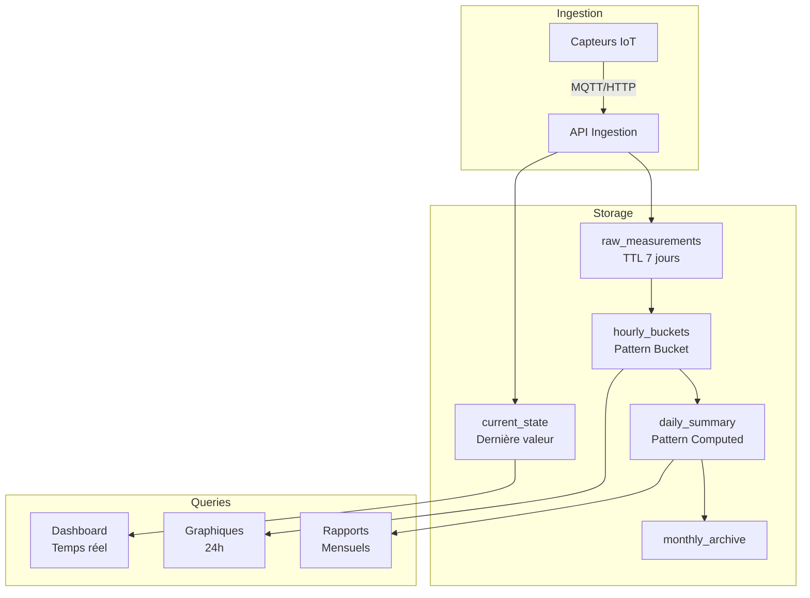

# TP3 : Modélisation avancée et patterns de conception MongoDB (4h)

## 🎯 Objectifs de la séance

### Objectifs pédagogiques
À l'issue de cette séance, vous serez capable de :
- **Choisir** entre embedding et référencement selon le cas d'usage
- **Appliquer** les patterns de modélisation MongoDB (Subset, Computed, Bucket, etc.)
- **Optimiser** les modèles pour les performances et la scalabilité
- **Concevoir** des schémas pour des applications IoT temps réel
- **Implémenter** des patterns avancés (versioning, archiving, CQRS)

### Lien avec le projet SteamCity
Cette séance est **cruciale** pour votre projet :
- Pattern **Bucket** pour les séries temporelles de capteurs
- Pattern **Computed** pour les statistiques pré-calculées
- Pattern **Outlier** pour les pics de données
- Architecture **CQRS** pour séparer lecture/écriture

### Prérequis
- TP1 et TP2 complétés
- Compréhension des pipelines d'agrégation
- MongoDB Atlas configuré

---

## 📚 Phase 1 : Les fondamentaux de la modélisation MongoDB (45 min)

### 1.1 Rappel : Embedding vs Référencement

#### Le spectre de la modélisation


| Approche | Quand l'utiliser | Avantages | Inconvénients |
|----------|------------------|-----------|---------------|
| **Embedding complet** | Données toujours lues ensemble | Performance lecture ++ | Duplication, limite 16MB |
| **Embedding partiel** | Subset fréquemment utilisé | Balance performance/flexibilité | Complexité sync |
| **Hybride** | Mix selon fréquence | Optimisé par cas | Plus complexe |
| **Références** | Données indépendantes | Normalisation | Requêtes multiples |

### 1.2 Les facteurs de décision

#### La matrice de décision

```javascript
// Facteurs à évaluer pour chaque relation
const decisionFactors = {
    // Cardinalité
    relationship: "1:N",        // 1:1, 1:N, N:N
    N_size: 100,                // Taille maximale de N
    
    // Patterns d'accès
    read_together: 0.95,        // Fréquence de lecture conjointe (0-1)
    write_ratio: 0.1,           // Ratio écriture/lecture (0-1)
    
    // Contraintes
    document_growth: "bounded",  // bounded, unbounded
    data_volatility: "low",      // low, medium, high
    
    // Performance
    query_isolation: false,      // Besoin de requêter séparément
    atomic_updates: true         // Besoin de transactions
};
```

### 1.3 Exercices de modélisation

#### Exercice 1 : E-commerce - Produits et Avis

**Contexte :** Un site e-commerce avec produits et avis clients.
- Un produit peut avoir des centaines d'avis
- Les 10 derniers avis sont affichés sur la page produit
- Une page séparée affiche tous les avis avec pagination

**Votre modélisation :**
```javascript
// Décrivez votre approche et créez les collections
// Votre réponse :

```

<details>
<summary>💡 Solution suggérée</summary>

```javascript
// Collection products - Embedding partiel (Pattern Subset)
{
    _id: ObjectId("..."),
    name: "iPhone 15",
    price: 999,
    description: "...",
    
    // Les 10 derniers avis (subset)
    recent_reviews: [
        {
            user_id: "U123",
            rating: 5,
            comment: "Excellent!",
            date: ISODate("2024-01-15"),
            helpful_count: 42
        }
        // ... max 10 avis
    ],
    
    // Statistiques pré-calculées
    review_stats: {
        count: 1234,
        average: 4.5,
        distribution: {
            5: 678,
            4: 345,
            3: 156,
            2: 45,
            1: 10
        }
    }
}

// Collection reviews - Tous les avis
{
    _id: ObjectId("..."),
    product_id: ObjectId("..."),
    user_id: "U123",
    rating: 5,
    comment: "Excellent produit, très satisfait...",
    date: ISODate("2024-01-15"),
    helpful_count: 42,
    verified_purchase: true,
    images: ["url1", "url2"]
}
```

**Justification :**
- **Subset embedding** : Les 10 derniers avis dans le produit pour performance
- **Collection séparée** : Tous les avis pour pagination et requêtes complexes
- **Computed pattern** : Statistiques pré-calculées pour éviter les agrégations
</details>

#### Exercice 2 : Réseau Social - Posts et Commentaires

**Contexte :** 
- Un post peut avoir des milliers de commentaires
- Les commentaires peuvent avoir des réponses (nested)
- Besoin de pagination et tri (plus récent, plus liké)

**Votre modélisation :**
```javascript
// Votre réponse :

```

#### Exercice 3 : IoT - Capteurs et Mesures

**Contexte pour SteamCity :**
- 1000 capteurs envoyant des données toutes les 5 minutes
- Besoin d'agrégations horaires/journalières
- Conservation : données brutes 7 jours, agrégées 1 an

**Votre modélisation :**
```javascript
// Votre réponse :

```

---

## 🎨 Phase 2 : Les Design Patterns MongoDB (60 min)

### 2.1 Pattern : Subset (Sous-ensemble)

**Problème :** Document avec un tableau qui peut devenir très large.

**Solution :** Garder seulement un subset pertinent dans le document principal.

```javascript
// ❌ Anti-pattern : Tous les followers dans le user
{
    _id: "user123",
    username: "alice",
    followers: [/* Potentiellement des millions! */]
}

// ✅ Pattern Subset
{
    _id: "user123",
    username: "alice",
    follower_count: 1250000,
    recent_followers: [
        // Les 20 derniers seulement
        {user_id: "u456", date: ISODate("..."), username: "bob"},
        // ...
    ]
}

// Collection séparée pour tous les followers
{
    _id: ObjectId(),
    user_id: "user123",
    follower_id: "u456",
    date: ISODate("...")
}
```

### 2.2 Pattern : Computed (Pré-calculé)

**Problème :** Calculs coûteux répétés fréquemment.

**Solution :** Pré-calculer et stocker les résultats.

```javascript
// ❌ Anti-pattern : Calculer à chaque fois
db.orders.aggregate([
    {$match: {user_id: "u123"}},
    {$group: {_id: null, total_spent: {$sum: "$amount"}}}
])

// ✅ Pattern Computed
{
    _id: "u123",
    username: "alice",
    // Statistiques pré-calculées
    stats: {
        total_orders: 156,
        total_spent: 12543.67,
        average_order: 80.41,
        last_order_date: ISODate("2024-01-15"),
        lifetime_value_score: 0.89,
        updated_at: ISODate("2024-01-15T10:00:00Z")
    }
}

// Mise à jour incrémentale
db.users.updateOne(
    {_id: "u123"},
    {
        $inc: {
            "stats.total_orders": 1,
            "stats.total_spent": 99.99
        },
        $set: {
            "stats.last_order_date": new Date(),
            "stats.updated_at": new Date()
        }
    }
)
```

### 2.3 Pattern : Bucket (Seau) pour Time-Series

**Problème :** Millions de points de données temporelles.

**Solution :** Grouper par tranches de temps.

```javascript
// ❌ Anti-pattern : Un document par mesure
{
    sensor_id: "SENS-001",
    timestamp: ISODate("2024-01-15T10:05:00Z"),
    temperature: 22.5
}
// → 288 documents/jour/capteur !

// ✅ Pattern Bucket : Un document par heure
{
    _id: ObjectId(),
    sensor_id: "SENS-001",
    bucket_hour: ISODate("2024-01-15T10:00:00Z"),
    
    // Tableau de mesures (12 par heure si toutes les 5 min)
    measurements: [
        {t: 0, temp: 22.5, hum: 45.2},    // t=0 : 10:00
        {t: 5, temp: 22.6, hum: 45.1},    // t=5 : 10:05
        {t: 10, temp: 22.4, hum: 45.3},   // t=10: 10:10
        // ...
    ],
    
    // Statistiques pré-calculées pour la période
    stats: {
        count: 12,
        temperature: {min: 22.1, max: 23.2, avg: 22.5},
        humidity: {min: 44.8, max: 46.1, avg: 45.2}
    }
}
// → 24 documents/jour/capteur (réduction 12x)
```

### 2.4 Pattern : Attribute (Attribut)

**Problème :** Schéma avec nombreux champs optionnels et variés.

**Solution :** Transformer les champs en tableau d'attributs.

```javascript
// ❌ Anti-pattern : Centaines de champs possibles
{
    sku: "PROD-123",
    color: "red",
    size: "XL",
    material: "cotton",
    weight: 250,
    waterproof: true,
    // ... potentiellement des centaines d'attributs
}

// ✅ Pattern Attribute
{
    sku: "PROD-123",
    // Attributs sous forme de tableau
    attributes: [
        {k: "color", v: "red", type: "string"},
        {k: "size", v: "XL", type: "string"},
        {k: "weight", v: 250, type: "number", unit: "g"},
        {k: "waterproof", v: true, type: "boolean"}
    ]
}

// Index pour recherche efficace
db.products.createIndex({"attributes.k": 1, "attributes.v": 1})

// Requête
db.products.find({
    attributes: {
        $all: [
            {$elemMatch: {k: "color", v: "red"}},
            {$elemMatch: {k: "size", v: "XL"}}
        ]
    }
})
```

### 2.5 Pattern : Outlier (Valeur aberrante)

**Problème :** Quelques documents avec tableaux énormes, la majorité petits.

**Solution :** Traiter différemment les outliers.

```javascript
// Cas : Un post viral avec 100k commentaires vs posts normaux avec <100

// ✅ Document normal
{
    _id: "post123",
    content: "Hello World",
    has_overflow: false,
    comments: [
        // Tous les commentaires (<100)
        {id: 1, text: "Nice!", user: "bob"},
        // ...
    ]
}

// ✅ Document outlier
{
    _id: "post456",
    content: "Post viral!",
    has_overflow: true,  // Flag indiquant overflow
    comment_count: 100000,
    comments: [
        // Seulement les 50 derniers
        {id: 99951, text: "...", user: "..."},
        // ...
    ]
}

// Collection overflow pour les commentaires supplémentaires
{
    post_id: "post456",
    bucket: 1,  // Bucket 1 = commentaires 51-1000
    comments: [/*...*/]
}
```

### 2.6 Exercices sur les patterns

#### Exercice 4 : Appliquer le pattern Bucket

**Contexte SteamCity :** Implémenter le stockage pour un capteur qui envoie :
- Température, humidité, CO2, PM2.5 toutes les 5 minutes
- Besoin d'agrégations horaires et journalières
- Requêtes fréquentes sur les dernières 24h

```javascript
// Créez le modèle avec pattern Bucket
// Votre réponse :

```

#### Exercice 5 : Combiner Subset + Computed

**Contexte :** Forum avec topics et réponses.
- Un topic peut avoir des milliers de réponses
- Afficher les 20 dernières sur la page principale
- Statistiques (nb réponses, dernier post, contributeurs uniques)

```javascript
// Votre modélisation :

```

---

## 🏗️ Phase 3 : Patterns architecturaux (45 min)

### 3.1 Pattern : Versioning des documents

**Problème :** Garder l'historique des modifications.

#### Option A : Versioning dans le document

```javascript
{
    _id: "doc123",
    version: 3,
    current: {
        title: "Version actuelle",
        content: "...",
        updated_at: ISODate("2024-01-15")
    },
    history: [
        {
            version: 2,
            title: "Ancienne version",
            content: "...",
            updated_at: ISODate("2024-01-10"),
            updated_by: "user456"
        },
        // ... versions précédentes
    ]
}
```

#### Option B : Collection séparée pour l'historique

```javascript
// Collection principale
{
    _id: "doc123",
    version: 3,
    title: "Version actuelle",
    content: "..."
}

// Collection historique
{
    _id: ObjectId(),
    doc_id: "doc123",
    version: 2,
    title: "Ancienne version",
    content: "...",
    updated_at: ISODate("2024-01-10")
}
```

### 3.2 Pattern : Polymorphic (Polymorphe)

**Problème :** Stocker différents types d'entités dans une collection.

```javascript
// Collection events : différents types d'événements
{
    _id: ObjectId(),
    type: "sensor_reading",
    timestamp: ISODate("..."),
    sensor_id: "SENS-001",
    data: {
        temperature: 22.5,
        humidity: 45
    }
}

{
    _id: ObjectId(),
    type: "alert",
    timestamp: ISODate("..."),
    severity: "high",
    message: "Temperature exceeded threshold",
    sensor_id: "SENS-001",
    threshold: 30,
    value: 32.5
}

{
    _id: ObjectId(),
    type: "maintenance",
    timestamp: ISODate("..."),
    sensor_id: "SENS-001",
    technician: "John Doe",
    actions: ["battery_replaced", "calibration"]
}

// Index partiel par type
db.events.createIndex(
    {sensor_id: 1, timestamp: -1},
    {partialFilterExpression: {type: "sensor_reading"}}
)
```

### 3.3 Pattern : CQRS (Command Query Responsibility Segregation)

**Problème :** Modèles optimaux différents pour lecture vs écriture.

```javascript
// ÉCRITURE : Collection optimisée pour les insertions
db.sensor_writes.insertOne({
    sensor_id: "SENS-001",
    timestamp: new Date(),
    temperature: 22.5,
    humidity: 45,
    co2: 410
})

// LECTURE : Collections optimisées pour les requêtes
// Mise à jour par batch ou change streams

// Vue 1 : Dernières valeurs par capteur
db.sensor_current.findOne({_id: "SENS-001"})
// {
//     _id: "SENS-001",
//     location: {...},
//     last_reading: {...},
//     status: "online"
// }

// Vue 2 : Agrégations horaires
db.sensor_hourly.find({
    sensor_id: "SENS-001",
    hour: ISODate("2024-01-15T10:00:00Z")
})

// Synchronisation avec Change Streams
const pipeline = [
    {$match: {operationType: "insert"}}
];

db.sensor_writes.watch(pipeline).on("change", (change) => {
    // Mettre à jour les vues de lecture
    updateCurrentView(change.fullDocument);
    updateHourlyView(change.fullDocument);
});
```

### 3.4 Pattern : Archive

**Problème :** Données anciennes rarement accédées mais à conserver.

```javascript
// Collection active (derniers 30 jours)
db.measurements.insertOne({
    sensor_id: "SENS-001",
    timestamp: new Date(),
    data: {...},
    ttl_date: new Date(Date.now() + 30*24*60*60*1000)
})

// Index TTL pour expiration automatique
db.measurements.createIndex(
    {ttl_date: 1},
    {expireAfterSeconds: 0}
)

// Archivage avant suppression
const archivePipeline = [
    {$match: {
        timestamp: {$lt: new Date(Date.now() - 29*24*60*60*1000)}
    }},
    {$merge: {
        into: "measurements_archive",
        whenMatched: "replace"
    }}
];

// Cron job quotidien
db.measurements.aggregate(archivePipeline)
```

---

## 💡 Phase 4 : Cas pratique IoT pour SteamCity (50 min)

### 4.1 Analyse des besoins

Votre module SteamCity doit gérer :
- **Volume :** 1000 capteurs × 288 mesures/jour = 288k documents/jour
- **Rétention :** 7 jours brut, 1 an agrégé
- **Requêtes :** Temps réel, historique, alertes, analytics

### 4.2 Architecture proposée



### 4.3 Implémentation des collections

#### Collection 1 : raw_measurements (données brutes)

```javascript
// Insertion temps réel
{
    _id: ObjectId(),
    sensor_id: "SENS-001",
    timestamp: ISODate("2024-01-15T10:05:00Z"),
    
    // Données brutes
    temperature: 22.5,
    humidity: 45.2,
    co2: 410,
    pm25: 12.3,
    
    // Métadonnées
    quality_score: 0.98,  // Qualité du signal
    battery_level: 85,
    
    // TTL pour suppression automatique
    expire_at: ISODate("2024-01-22T10:05:00Z")
}

// Index
db.raw_measurements.createIndex({sensor_id: 1, timestamp: -1})
db.raw_measurements.createIndex({expire_at: 1}, {expireAfterSeconds: 0})
```

#### Collection 2 : hourly_buckets (Pattern Bucket)

```javascript
{
    _id: {
        sensor_id: "SENS-001",
        hour: ISODate("2024-01-15T10:00:00Z")
    },
    
    // Mesures compactées (t = minutes depuis l'heure)
    measurements: [
        {t: 0, temp: 22.5, hum: 45.2, co2: 410, pm25: 12.3},
        {t: 5, temp: 22.6, hum: 45.1, co2: 408, pm25: 12.1},
        // ... max 12 entrées
    ],
    
    // Statistiques pré-calculées
    stats: {
        count: 12,
        temperature: {
            min: 22.1, max: 23.2, avg: 22.5,
            std_dev: 0.3
        },
        humidity: {
            min: 44.8, max: 46.1, avg: 45.2
        },
        // ... autres métriques
    },
    
    // Détection d'anomalies
    anomalies: [
        {t: 25, type: "spike", metric: "co2", value: 850}
    ],
    
    updated_at: ISODate("2024-01-15T10:59:59Z")
}

// Pipeline d'agrégation pour créer les buckets
db.raw_measurements.aggregate([
    {$match: {
        sensor_id: "SENS-001",
        timestamp: {
            $gte: ISODate("2024-01-15T10:00:00Z"),
            $lt: ISODate("2024-01-15T11:00:00Z")
        }
    }},
    {$group: {
        _id: {
            sensor_id: "$sensor_id",
            hour: {$dateTrunc: {date: "$timestamp", unit: "hour"}}
        },
        measurements: {
            $push: {
                t: {$minute: "$timestamp"},
                temp: "$temperature",
                hum: "$humidity",
                co2: "$co2",
                pm25: "$pm25"
            }
        },
        // Calculer les stats
        temp_values: {$push: "$temperature"},
        // ...
    }},
    {$project: {
        measurements: 1,
        stats: {
            count: {$size: "$measurements"},
            temperature: {
                min: {$min: "$temp_values"},
                max: {$max: "$temp_values"},
                avg: {$avg: "$temp_values"},
                std_dev: {$stdDevPop: "$temp_values"}
            }
            // ...
        }
    }},
    {$merge: {
        into: "hourly_buckets",
        on: "_id",
        whenMatched: "replace"
    }}
])
```

#### Collection 3 : current_state (état actuel)

```javascript
{
    _id: "SENS-001",  // sensor_id comme _id pour lectures rapides
    
    // Localisation
    location: {
        type: "Point",
        coordinates: [5.447427, 43.529742],
        address: "Place Rotonde, Aix-en-Provence"
    },
    
    // Dernière mesure
    last_reading: {
        timestamp: ISODate("2024-01-15T10:55:00Z"),
        temperature: 22.5,
        humidity: 45.2,
        co2: 410,
        pm25: 12.3
    },
    
    // État et santé
    status: "online",  // online, offline, maintenance
    battery_level: 85,
    last_maintenance: ISODate("2024-01-01"),
    
    // Statistiques rolling window (dernière heure)
    last_hour_stats: {
        avg_temperature: 22.5,
        max_co2: 425,
        alert_count: 0
    },
    
    // Configuration des seuils
    thresholds: {
        temperature: {min: 15, max: 30},
        co2: {max: 1000},
        pm25: {max: 50}
    }
}
```

### 4.4 Exercices d'implémentation

#### Exercice 6 : Pipeline d'agrégation temps réel

Créez un pipeline qui génère un rapport temps réel :
- Les 10 capteurs avec les températures les plus élevées
- Leur localisation
- L'écart par rapport à leur moyenne horaire

```javascript
// Votre pipeline :

```

#### Exercice 7 : Détection d'anomalies

Créez une fonction qui détecte les anomalies :
- Valeur > 3 × écart-type de la moyenne horaire
- Changement brusque (>20% en 5 minutes)
- Capteur offline (pas de données depuis 15 minutes)

```javascript
// Votre fonction :

```

---

## 🔧 Phase 5 : Optimisation et bonnes pratiques (20 min)

### 5.1 Stratégies d'indexation

```javascript
// Index composés pour les patterns d'accès courants
// Ordre des champs : Égalité, Tri, Plage

// ✅ BON : Supporte {sensor_id: "X"} et {sensor_id: "X", timestamp: {$gte: ...}}
db.measurements.createIndex({sensor_id: 1, timestamp: -1})

// ❌ MAUVAIS : L'ordre inverse ne supporte pas la requête sur sensor_id seul
db.measurements.createIndex({timestamp: -1, sensor_id: 1})

// Index partiels pour économiser l'espace
db.measurements.createIndex(
    {sensor_id: 1, alert: 1},
    {partialFilterExpression: {alert: true}}
)

// Index TTL pour expiration automatique
db.measurements.createIndex(
    {expire_at: 1},
    {expireAfterSeconds: 0}
)
```

### 5.2 Patterns de mise à jour

```javascript
// ✅ Mise à jour atomique avec retry
async function updateWithRetry(collection, filter, update, maxRetries = 3) {
    let retries = 0;
    while (retries < maxRetries) {
        try {
            const result = await collection.updateOne(filter, update);
            if (result.matchedCount === 0) {
                // Document n'existe pas, le créer
                await collection.insertOne({...filter, ...update.$setOnInsert});
            }
            return result;
        } catch (error) {
            if (error.code === 11000 && retries < maxRetries - 1) {
                // Duplicate key, retry
                retries++;
                await new Promise(r => setTimeout(r, 100 * Math.pow(2, retries)));
            } else {
                throw error;
            }
        }
    }
}

// ✅ Bulk operations pour performance
const bulkOps = measurements.map(m => ({
    updateOne: {
        filter: {_id: m.sensor_id},
        update: {
            $set: {last_reading: m},
            $inc: {reading_count: 1}
        },
        upsert: true
    }
}));

await db.current_state.bulkWrite(bulkOps);
```

### 5.3 Monitoring et métriques

```javascript
// Collection pour métriques système
{
    _id: ObjectId(),
    timestamp: ISODate("2024-01-15T10:00:00Z"),
    type: "system_metrics",
    
    metrics: {
        // Performance
        inserts_per_second: 1250,
        queries_per_second: 450,
        avg_query_time_ms: 12,
        
        // Stockage
        database_size_gb: 45.2,
        index_size_gb: 8.3,
        document_count: 15234567,
        
        // Santé
        active_sensors: 987,
        offline_sensors: 13,
        error_rate: 0.002
    }
}

// Vue pour dashboard de monitoring
db.createView("system_health", "metrics", [
    {$match: {type: "system_metrics"}},
    {$sort: {timestamp: -1}},
    {$limit: 1},
    {$project: {
        _id: 0,
        timestamp: 1,
        status: {
            $cond: {
                if: {$lt: ["$metrics.error_rate", 0.01]},
                then: "healthy",
                else: "degraded"
            }
        },
        metrics: 1
    }}
])
```

### 5.4 Checklist d'optimisation

- [ ] **Index appropriés** pour tous les patterns de requête
- [ ] **Projection** pour limiter les données transférées
- [ ] **Batch operations** pour les écritures multiples  
- [ ] **Connection pooling** configuré correctement
- [ ] **Read preference** adaptée (primary vs secondary)
- [ ] **Write concern** selon criticité (1, majority, journaled)
- [ ] **Compression** activée (WiredTiger: snappy/zstd)
- [ ] **Monitoring** des métriques clés

---

## 💼 Mini-projet : Conception complète pour SteamCity (20 min)

### Mission

Concevez l'architecture de données complète pour votre module SteamCity en appliquant les patterns appris.

### Spécifications

Votre module doit :
1. Ingérer 1M mesures/jour de 1000 capteurs
2. Fournir un dashboard temps réel (<1s latence)
3. Générer des rapports horaires/journaliers/mensuels
4. Détecter et alerter sur les anomalies
5. Archiver les données > 30 jours

### Livrables attendus

```javascript
// 1. Schéma des collections (au moins 3)

// 2. Pipeline d'ingestion

// 3. Requêtes critiques avec index

// 4. Stratégie d'archivage

// Votre solution complète :

```

---

## ✅ Checklist de validation

### Modélisation
- [ ] Je sais choisir entre embedding et référencement
- [ ] Je connais les facteurs de décision (cardinalité, volatilité, etc.)
- [ ] Je peux identifier quand utiliser chaque approche

### Design Patterns
- [ ] Pattern **Subset** pour limiter la taille des tableaux
- [ ] Pattern **Computed** pour les calculs pré-calculés
- [ ] Pattern **Bucket** pour les séries temporelles
- [ ] Pattern **Attribute** pour les schémas flexibles
- [ ] Pattern **Outlier** pour les cas exceptionnels

### Patterns Architecturaux
- [ ] **Versioning** pour l'historique
- [ ] **Polymorphic** pour types multiples
- [ ] **CQRS** pour séparer lecture/écriture
- [ ] **Archive** pour les données anciennes

### Optimisation
- [ ] Stratégies d'indexation appropriées
- [ ] Bulk operations et retry logic
- [ ] Monitoring et métriques

### Application IoT
- [ ] Modélisation pour time-series
- [ ] Gestion du volume de données
- [ ] Stratégies d'agrégation
- [ ] Détection d'anomalies

---

## 📚 Ressources

### Documentation officielle
- [MongoDB Schema Design Best Practices](https://www.mongodb.com/blog/post/building-with-patterns-a-summary)
- [MongoDB University - M320: Data Modeling](https://university.mongodb.com/courses/M320/about)
- [Time Series Data and MongoDB](https://www.mongodb.com/docs/manual/core/timeseries-collections/)

### Patterns détaillés
- [Building with Patterns Blog Series](https://www.mongodb.com/blog/post/building-with-patterns-a-summary)
- [Schema Design Anti-Patterns](https://www.mongodb.com/developer/products/mongodb/schema-design-anti-pattern/)

### Outils
- [MongoDB Compass Schema Analysis](https://www.mongodb.com/products/compass)
- [Studio 3T Schema Explorer](https://studio3t.com/)

---

**Prochain TP :** Performance et optimisation avancée MongoDB
